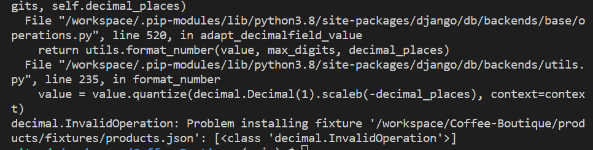

# Coffee Boutique 

Live App link : [Coffee Boutique]()

Git Hub Repository : [Coffee Boutique Repository]()

Coffee Boutique is a online E-commerce website engaged in the selling of Coffee & associated Coffee Product. The store offers it's shoppers a wide range of Coffee as well as Coffee product such as machines, manual coffee makers, gift sets and even some treats for those with a sweet tooth.
The App is aimed at all Coffee Lovers and shows it love of Coffee in its design and colour choice.

# Contents

- [User Experience(UX)](#user-experience-ux)
   * [Scope](#scope)
   * [User Stories](#user-stories)
        * [Agile Method](#agile-method-git-projects)
        * [Future Features](#future-features) 
   * [Design](#design)
      * [Colour Scheme](#colour-scheme)
      * [Images](#images)
      * [Product Descriptions](#product-descriptions)
      * [Fixtures Categories & Products](#fixtures-categories--products)
      * [Font](#fonts)
      * [Wireframes(Balsamiq Wireframes)](#balsamiq-wireframes)
      * [Data Modal](#data-modal)
   * [Security Features and Defensive Design](#security-features-and-defensive-design)
      * [User Authentication](#user-authentication)
      * [Form Validation](#form-validation)
      * [Database Security](#database-security)
      * [Custom error pages:](#custom-error-pages)

- [Features](#features)
   * [HomePage](#home-page)
   * [UserAccountPages](#user-account-pages)
   

- [AdminControl](#admin-control)
   * [AdminControlPanel](#admin-control-panel)
   * [AdminLogin](#admin-login)
   

- [Technologies](#technologies)
   * [Programming Languages](#programming-languages)
   * [Support Programs & Libraries](#support-programs--libraries)

- [Testing](#testing)
   * [Bugs](#bugs)
   * [ManualTesting](#manual-testing)
        * [NavigationHeader](#navigation-header)
        * [NavigationFooter](#navigation-footer)
      * [SignUpManualTesting](#sign-up-manual-testing)
      * [SignInManualTesting](#sign-in-manual-testing)
      * [SignOutManualTesting](#sign-out-manual-testing)  
      * [AdminControlMaualTesting](#admin-control-maual-testing)          
          * [AdminLoginMaualTest](#admin-login-maual-test)
          * [AdminControlPanelMaualTesting](#admin-control-panel-maual-testing)
                         
    * [Validation](#validator-testing)

- [Deployment](#deployment)
   * [Github](#github)
   * [Django and Heroku](#django-and-heroku)   
   * [Clone Project](#clone-project)

- [Acknowledgments](#acknowledgments)
    * [Credits](#credits)
    * [CopiedCode&CodeAssistance](#copied-code--code-assistance)
    * [Note](#note)

## User Experience UX

## Scope

As an App Developer & Designer, I have tried to incorporate the needs of the Shopper & Business Owner/Admin Manager along with a User-Friendly navigation & an aesthetically pleasing App. The App is designed for the use of anyone who Loves & wishes to purchase Coffee & Coffee Products with an easy to use check out system.

   *  Main App Goals
      +	To provide our Shoppers with a good website experience and relevant coffee content on display
      + To provide our Shoppers with a visually pleasing website that is easy to navigate.
      + To provide our Shoppers a website with a clear purpose and understanding of their needs.
      + To provide our Shopper with the correct tools allowing shopper to search for products ,leave reviews and rate the products.
      + To provide our Shopper with an easy and safe way to purchase our coffee products.
      + To provide our Shoppers with access to mailing list so that they may be informed on our coffee products.

[Back to top ⇧](#contents)

## User Stories

I have used the Agile method starting with the Epics from which the User Stories are propagated and Task required to complete the User Stories.

### Epic : Navigation & Viewing 

1.	Navigate around the site with ease .
2.	Navigate to & view a list of Coffee products and choose accordingly.
3.	Click on a Coffee product to read and view the details
4.  Find Specific Category of Products to quickly find products interested in
5.	View Coffee product Reviews so that I can read other Shopper opinions.

### Epic : Registration & User Accounts

1.	Register for an account to avail of the services offered to members
2.	Login & Logout of the website.
3.	Recover my password easily if case I forget it .
4.	Receive confirmation of my registration via email
5.	Be given a personal profile that I can manage my own details on & from.

### Epic : Review & Rate Products

1.	Review the Coffee Products .
2.	Delete my Previous reviews.
3.	Edit my Previous reviews.
4.	Rate / change my rating on a Coffee Product.

### Epic : Sorting & Searching 

1.	Search for Coffee products via name to find a specific product.
2.	Sort through a list of available products
3.	Sort via Categories for coffee products
4.	Know easily what I have searched for & how many results I have gotten 

### Epic : Purchasing & Check Out

1.	Easily select a product size & quantity.
2.	View what I have chosen in my shopping Cart
3.	Be able to adjust quantity of my purchase in my shopping Cart.
4.	Easily fill out the payment information & use the checkout system provided
5.	Feel that my details are safe & secure
6.	Get confirmation that my order has been processed after checkout.
7.	Receive a Confirmation email for my order after I have checked out . 

### Epic : Favourite Products

1.	Have a Favourite Products section so I can find them again
2.	Have easy access to my Favourite Products – navigate to 
3.	Easily add my favourite products
4.	Easily delete products that I no longer favour

### Epic : Admin & Store Management

1.	Login & Log out and have access to an Admin section via website
2.	Add new product.
3.	Edit a product.
4.	Delete a product
5.	Be able to add / update / delete a Discount Coupon

[Back to top ⇧](#contents)

## Agile Method Git Projects

GitHub projects was used to manage the development process using an agile approach. Please see link to project [Kanban Board]()

Not all Epics have made it into the project using the MSCW Method you will find on the Kanban Must have’s, Should Have’s, Could Have's and Won’t have labels. 

## Future Features

[Back to top ⇧](#contents)

# Design

## Colour Scheme

## Images

### Images Credit for Project

 

Images

* [Product Images obtained via Code Institute](https://learn.codeinstitute.net/)
    + Image 1  . [noimage](https://github.com/Code-Institute-Solutions/boutique_ado_images/tree/master/pics)
          
* [Product Images obtained via Freepik.com](https://www.freepik.com/)
    + Image 1  . [mildly-blue-coffee-ground-light-roast](https://www.freepik.com/free-psd/paper-coffee-bag-branding-mockup_32418528.htm#query=coffee%20bag%20mockup&position=4&from_view=search&track=ais)
    + Image 2  . [cheeky-moco-coffee-ground-fine-roast](https://www.freepik.com/free-psd/glossy-foil-coffee-bag-packaging-mockup_29072572.htm#query=coffee%20bag%20mockup&position=19&from_view=search&track=ais)
    + Image 3  . [wonderfully-wild-coffee-ground-classic-roast](https://www.freepik.com/free-psd/coffee-pouch-packaging-mockup-front-view_34981719.htm#query=coffee%20bag%20mockup&position=2&from_view=search&track=ais)
    + Image 4  . [gray-day-pick-up-coffee-ground-fine-roast](https://www.freepik.com/free-psd/kraft-paper-coffee-bag-packaging-mockup_32469423.htm#query=coffee%20packaging%20mockup&position=25&from_view=search&track=ais)
    + Image 5  . [perky-pink-coffee-ground-hand-roast](https://www.freepik.com/free-psd/glossy-paper-coffee-bag-packaging-mockup_32417142.htm#query=coffee%20packaging%20mockup&position=33&from_view=search&track=ais)
    + Image 6  . [all-about-you-coffee-ground-medium-roast](https://www.freepik.com/free-psd/glossy-foil-coffee-bag-packaging-mockup_29813447.htm#query=coffee%20bag%20mockup&position=28&from_view=search&track=ais)
    + Image 7  . [golden-goddess-coffe-ground-medium-dark-roast](https://www.freepik.com/free-psd/glossy-metal-coffee-jar-packaging-mockup_25603323.htm#page=2&query=coffee%20bag%20mockup&position=14&from_view=search&track=ais)
    + Image 8  . [brazen-bronze-coffee-grounds-dark-roast](https://www.freepik.com/free-psd/glossy-paper-coffee-bag-with-tag-label-packaging-mockup_29594159.htm#page=2&query=coffee%20bag%20mockup&position=24&from_view=search&track=ais)
    + Image 9  . [rambunctious-red-coffee-ground-medium-dark-roast](https://www.freepik.com/free-psd/kraft-paper-coffee-bag-with-tag-label-branding-mockup_29594114.htm#page=2&query=coffee%20bag%20mockup&position=28&from_view=search&track=ais) 
    + Image 10 . [vivaciously-vanilla-coffee-grounds-fine-roast](https://www.freepik.com/free-psd/glossy-paper-coffee-bag-packaging-mockup_32704249.htm#page=2&query=coffee%20bag%20mockup&position=9&from_view=search&track=ais)
    + Image 11 . [rearing-to-go-coffee-beans-robust-roast](https://www.freepik.com/free-psd/glossy-paper-coffee-bag-branding-mockup_29813265.htm#query=coffee%20bean%20bag%20mockup&position=13&from_view=search&track=ais)
    + Image 12 . [perky-pink-coffee-beans-hand-roast](https://www.freepik.com/free-psd/glossy-paper-coffee-bag-packaging-mockup_32417116.htm#query=coffee%20bean%20bag%20mockup&position=20&from_view=search&track=ais)
    + Image 13 . [out-of-this-world-coffee-beans-organic-roast](https://www.freepik.com/free-psd/kraft-paper-coffee-bag-branding-mockup_28193651.htm#query=coffee%20bean%20bag%20mockup&position=27&from_view=search&track=ais)
    + Image 14 . [all-about-you-coffee-beans-medium-roast](https://www.freepik.com/free-psd/glossy-foil-coffee-bag-packaging-mockup_29813446.htm#query=coffee%20bean%20bag%20mockup&position=28&from_view=search&track=ais)
    + Image 15 . [lazy-bones-coffee-beans-smooth-roast](https://www.freepik.com/free-psd/packaging-mockup-coffee-shop-psd_8019958.htm#query=coffee%20bean%20bag%20mockup&position=36&from_view=search&track=ais)
    + Image 16 . [wide-awake-coffee-beans-classic-roast](https://www.freepik.com/free-psd/coffee-bags-mockup-gravity-psd_7587411.htm#query=coffee%20bean%20bag%20mockup&position=47&from_view=search&track=ais)
    + Image 17 . [dangerous-darkblue-coffee-bean-dark-roast](https://www.freepik.com/free-psd/paper-coffee-bag-packaging-mockup_27715027.htm#page=2&query=coffee%20bean%20bag%20mockup&position=1&from_view=search&track=ais)
    + Image 18 . [mildly-blue-coffee-beans-light-roast](https://www.freepik.com/free-psd/paper-coffee-bag-branding-mockup_32418503.htm#page=2&query=coffee%20bean%20bag%20mockup&position=10&from_view=search&track=ais)
    + Image 19 . [gray-day-pick-up-coffee-beans-fine-roast](https://www.freepik.com/free-psd/kraft-paper-coffee-bag-packaging-mockup_32469417.htm#page=2&query=coffee%20bean%20bag%20mockup&position=21&from_view=search&track=ais)
    + Image 20 . [golden-goddess-coffe-beans-medium-dark-roast](https://www.freepik.com/free-psd/glossy-foil-coffee-pouch-bag-branding-mockup_31027419.htm#page=3&query=coffee%20bean%20bag%20mockup&position=8&from_view=search&track=ais)
    + Image 21 . [in-a-blink-blue-coffee-capsule-pod](https://www.freepik.com/free-psd/coffee-capsule-mockup_9054756.htm#query=coffee%20pods&position=0&from_view=search&track=sph)
    + Image 22 . [charging-cappuccino-coffee-capsule-pod](https://www.freepik.com/free-photo/top-view-coffee-capsules_13661702.htm#page=2&query=coffee%20capsule%20mock%20up&position=36&from_view=search&track=ais)
    + Image 23 . [mighty-mochaccino-coffee-capsule-pod](https://www.freepik.com/free-photo/top-view-coffee-beans-coffee-capsules_13661696.htm#page=9&query=coffee%20capsule%20mock%20up&position=16&from_view=search&track=ais)
    + Image 24 . [vibrant-vanilla-coffee-capsule-pod](https://www.freepik.com/free-photo/top-view-coffee-beans-coffee-capsules_13661694.htm#page=18&query=coffee%20capsule%20mock%20up&position=27&from_view=search&track=ais)
    + Image 24 . [white-coffee-mug-with-hello-friday-on-wooden-table-green-plant](https://www.freepik.com/free-psd/cup-mockup-with-floral-decoration_1258228.htm#query=mugs&position=34&from_view=search&track=sph)
    + Image 26 . [two-mugs-one-blue-one-green-on-white-background](https://www.freepik.com/free-psd/two-mugs-white-background-mockup_19196951.htm#query=mugs&position=40&from_view=search&track=sph)
    + Image 27 . [black-coffee-cup-white-inner-white-background-coffeebeans](https://www.freepik.com/free-photo/coffee-cup-beans-white-background_1007883.htm#query=coffee%20mug&position=9&from_view=search&track=sph)
    + Image 28 . [white-coffee-mug-with-saying-rise-up-and-attack-the-day-with-enthusiasm-wooden-table-with-chocolate-filled-pastry](https://www.freepik.com/free-psd/breakfast-mockup-with-croissants_1312889.htm#query=coffee%20mug&position=12&from_view=search&track=sph)
    + Image 29 . [white-coffee-cup-plate-on-wooden-table](https://www.freepik.com/free-photo/tasty-coffee-white-cup_977687.htm#query=coffee%20mug&position=19&from_view=search&track=sph)
    + Image 30 . [artistic-cream-green-black-coffee-mug](https://www.freepik.com/free-photo/cozy-cup-tea_9435279.htm#query=coffee%20mug%20rustic&position=10&from_view=search&track=ais)
    + Image 31 . [espresso-glass-steel-base-and-handle-white-background-coffeebeans](https://www.freepik.com/free-photo/coffee-cup_6189972.htm#query=coffee%20esspresso%20cups&position=8&from_view=search&track=ais)
    + Image 32 . [traditional-bronze-turkish-arabic-coffee-glass-one-wooden-desk](https://www.freepik.com/free-photo/traditional-turkish-arabic-tea-glass-one-wooden-desk_4029661.htm#query=esspresso%20cups&position=35&from_view=search&track=ais)
    + Image 33 . [three-cups-espresso-sea-shell-decorated-on-wooden-board](https://www.freepik.com/free-photo/three-cups-espresso-wooden-board_14202267.htm#page=2&query=esspresso%20cups&position=21&from_view=search&track=ais)
    + Image 34 . [diamond-triangle-patern-black-ceramic-cup-black-plate-white-ceramic-cup-white-plate-on-warm-wooden-table](https://www.freepik.com/free-photo/close-up-picture-black-ceramic-cup-black-plate-white-ceramic-cup-white-plate-is-brown-table_10478103.htm#page=3&query=esspresso%20cups&position=41&from_view=search&track=ais)
    + Image 35 . [glass-stainless-steel-french-press](https://www.freepik.com/free-vector/stainless-steel-machines-tea-coffee_11058481.htm#query=french%20press%20mock%20up&position=6&from_view=search&track=ais)
    + Image 36 . [glass-brozen-french-press](https://www.freepik.com/free-photo/black-tea-table_7734431.htm#query=french%20press%20coffee&position=12&from_view=search&track=ais)
    + Image 37 . [beautiful-side-transparent-chrome-drip-coffee-maker-with-roasted-filtered-coffee-isolated-thick-wooden-table-cafe-shop-white-weights-steam-brutal](https://www.freepik.com/free-photo/beautiful-side-transparent-chrome-drip-coffee-maker-with-roasted-filtered-coffee-isolated-thick-wooden-table-cafe-shop-white-weights-steam-brutal_11621781.htm#query=french%20press%20coffee&position=27&from_view=search&track=ais)
    + Image 38 . [glass-stainless-steel-maze-pattern-french-press](https://www.freepik.com/free-photo/hot-tea-glass-teapot_7540226.htm#query=french%20press%20coffee&position=32&from_view=search&track=ais)
    + Image 39 . [glass-pour-coffee-maker-manual-drip-brewer](https://www.freepik.com/free-photo/coffee-maker-machine-table_13661642.htm#query=french%20press%20coffee&position=43&from_view=search&track=ais)
    + Image 40 . [coffee-moka-pot-red-aluminium](https://www.freepik.com/free-psd/coffee-shop-moka-pot-icon-isolated-3d-render-illustration_28991098.htm#query=moka%20pot&position=4&from_view=search&track=sph)
    + Image 41 . [mini-coffee-moka-pot-high-gloss-stainless-steel-coffee-beans-hesian-bag](https://www.freepik.com/free-photo/coffee-composition-with-moka-pot-bag_1264959.htm#query=moka%20pot&position=26&from_view=search&track=sph)
    + Image 42 . [coffee-moka-pot-aluminium-top-red-bottom-silver-with-three-red-blue-yellow-cups-on-table](https://www.freepik.com/free-photo/italian-mocca-coffee-with-cups-table_35817710.htm#query=moka%20pot&position=19&from_view=search&track=sph)
    + Image 43 . [mini-coffee-moka-pot-matted-stainless-steel](https://www.freepik.com/free-photo/preparing-breakfast_3994961.htm#page=3&query=coffee%20moka%20pot&position=12&from_view=search&track=ais)
    + Image 44 . [coffee-moka-pot-green-aluminium-lid-open](https://www.freepik.com/free-photo/high-angle-coffee-pot-arrangement_12670138.htm#page=2&query=coffee%20french%20press&position=39&from_view=search&track=ais)
    + Image 45 . [gift-set-drippingly-grand-small-metal-coffee-pot-glass-drip-pot-filter-drip-stand-wooden-bar-counter](https://www.freepik.com/free-photo/close-up-coffee-brewing-gadgets-wooden-bar-counter_8225456.htm#page=2&query=coffeee%20french%20press&position=31&from_view=search&track=ais)
    + Image 46 . [gift-set-fully-loaded-glass-drip-pot-bronze-coffe-pot-milk-jug-and-hand-grinder-glass-cup-white-ceramic-leaf-sauce-ramekin-wooden-cup-place-holder-small-wood-spoon-storage](https://www.freepik.com/free-photo/equipment-coffee-maker-barista_4695472.htm#page=3&query=coffeee%20french%20press&position=49&from_view=search&track=ais)
    + Image 47 . [gift-set-grindingly-good-blue-cup-on-plate-wooden-coffee-grinder-with-freshly-ground-coffee-scattered-coffee-beans](https://www.freepik.com/free-photo/cup-coffee-with-freshly-ground-coffee_903419.htm#page=5&query=coffeee%20french%20press&position=25&from_view=search&track=ais)
    + Image 48 . [gift-set-moka-up-bag-of-coffee-silver-spoon-metal-moka-coffee-brewer-white-mug](https://www.freepik.com/free-photo/arrangement-coffee-grinder-with-sack-mug-front-view_6918144.htm#page=6&query=coffeee%20french%20press&position=21&from_view=search&track=ais)
    + Image 49 . [gift-set-on-the-go-cardboard-fold-down-lid-box-white-with-design-bottom-of-bag-of coffee-beans-to-go-ceramic-white-mug-lid-milkly-coffee](https://www.freepik.com/free-psd/glossy-paper-coffee-bag-packaging-mockup_32704209.htm#query=coffee%20bags&position=41&from_view=search&track=sph)
    + Image 50 . [gift-set-the-traditional-hessian-sack-bag-of-coffee-beans-with-scattered-coffee-beans](https://www.freepik.com/free-photo/sack-with-scattered-coffee-beans_4870120.htm#page=3&query=coffee%20bags&position=3&from_view=search&track=sph)
    + Image 51 . [treat-oatmeal-chocolate-coffee-cookies-mixture](https://www.freepik.com/free-photo/oatmeal-chocolate-cookies-mixture-top-view_7101401.htm#query=biscuits&from_query=buscuits&position=5&from_view=search&track=sph)
    + Image 52 . [treat-coffee-crunch-chocolate-coated-cookies-overhead-shot-on-oven-tray](https://www.freepik.com/free-photo/overhead-shot-chocolate-cookies-oven-tray_7848264.htm#query=biscuits&from_query=buscuits&position=12&from_view=search&track=sph)
    + Image 53 . [treat-chocolate-chip-cookies-stacked-on-wooden-board](https://www.freepik.com/free-photo/chocolate-cookies-arrangement-with-copy-space_9906866.htm#query=biscuits&from_query=buscuits&position=25&from_view=search&track=sph)
    + Image 54 . [treat-delicious-chocolate-assortment](https://www.freepik.com/free-photo/close-up-view-delicious-chocolate-assortment_8327563.htm#page=2&query=chocolate&position=4&from_view=search&track=sph)
    + Image 55 . [treat-dusky-pink-french-coffee-macaroons-with-coffee-beans](https://www.freepik.com/free-photo/french-macaroons-with-coffee-beans_13340609.htm#query=chocolate%20coffee&position=44&from_view=search&track=sph)
    + Image 56 . [treat-chocolate-brownies-sackcloth-coffee-beans-wooden-table](https://www.freepik.com/free-photo/chocolate-brownies-sackcloth-coffee-beans-wooden-table_7675221.htm#query=brownies&position=13&from_view=search&track=sph)
    + Image 57 . [treat-cuppachino-cupcakes-mixed-with-chocolate-chip-white-plate](https://www.freepik.com/free-photo/banana-cupcakes-mixed-with-chocolate-chip-white-plate_7675227.htm#query=coffee%20muffins&position=2&from_view=search&track=sph)
    + Image 58 . [treat-chocolate-covered-mini-coffee-cakes](https://www.freepik.com/free-photo/fresh-chocolate-mini-cakes_2954822.htm#query=coffee%20truffels%20chocolate&position=31&from_view=search&track=ais)
    + Image 59 . [treat-chocolate-truffles-cocoa-powder-top-view-plate](https://www.freepik.com/free-photo/top-view-plate-with-chocolate-candy-cocoa-powder_8621610.htm#query=coffee%20truffels%20chocolate&position=29&from_view=search&track=ais)
    + Image 60 . [treat-choco-chino-biscuit-bears-hot-chocolate-tray](https://www.freepik.com/free-photo/biscuit-bears-hot-chocolate-tray_3075452.htm#page=2&query=coffee%20truffels%20chocolate&position=2&from_view=search&track=ais)

* [Product Images obtained via Hiclipart.com](https://www.hiclipart.com/)
    + Image 1  . [galloping-gold-coffee-capsule-pod](https://www.hiclipart.com/free-transparent-background-png-clipart-cjwar/download?height=200)
    + Image 2  . [galvanizing-green-coffee-capsule-pod](https://www.hiclipart.com/free-transparent-background-png-clipart-xgsrq/download?height=200)
    + Image 3  . [blazing-blue-coffee-capsule-pod](https://www.hiclipart.com/free-transparent-background-png-clipart-ldxbm/download?width=200)
    + Image 4  . [brazen-bronze-coffee-capsule-pod](https://www.hiclipart.com/free-transparent-background-png-clipart-nserb/download?width=200)

* [Product Images obtained via Pexels.com](https://www.pexels.com/)    
    + Image 1  . [classy-classic-coffee-capsule-pod](https://www.pexels.com/photo/collection-of-capsules-for-coffee-machine-4226867/)
    + Image 2  . [cheeky-cherry-choco-coffee-capsule-pod](https://www.pexels.com/photo/coffee-capsules-in-close-up-photography-10320269/)

* [Product Images obtained via Pngimg.com](https://pngimg.com/)     
    + Image 1  . [genio-touch-pod-coffee-capsule-pod-machine](https://pngimg.com/image/17264)
    + Image 2  . [gusto-pod-coffee-capsule-pod-machine-red](https://pngimg.com/image/17277)
    + Image 3  . [happy-pod-coffee_capsule-pod-machine-silver-and-black](https://pngimg.com/image/17292)
    + Image 4  . [my-way-pod-coffee-capsule-machine-black](https://pngimg.com/image/17299)
    + Image 5  . [vivy-pod-coffee-capsule-pod-machine-silver](https://pngimg.com/image/17312)
    + Image 6  . [coffee-filter-pot-machine-i-belong-black-10-cups](https://pngimg.com/image/17268)
    + Image 7  . [coffee-machine-full-touch-colorful-visual-screen-cappuccino-latte-fully-automatic-with-milk-frother-silver](https://pngimg.com/image/17260)
    + Image 8  . [coffee-machine-nescafe-alergria-red-and-silver](https://pngimg.com/image/17258)
    + Image 9  . [coffee-machine-cappuccino-automatic-bean-to-cup-with-auto-milk-silver](https://pngimg.com/image/17263)
    + Image 10 . [coffee-machine-Just-4-u-next-gen-premium-class-silver-two-milk-coffee-milk-cups](https://pngimg.com/image/17272)
    + Image 11 . [coffee-filter-pot-machine-easy-me-10-cups](https://pngimg.com/image/17287)
    + Image 12 . [coffee-machine-faema-x30-milkps-single-step-super-automatic-espresso-machine-top-load-beans-chocolate-powder-digital-screen-interface-silver-and-black](https://pngimg.com/image/102182)
    + Image 13 . [coffee-machine-full-touch-colorful-visual-screen-cappuccino-latte-fully-automatic-with-milk-frother-silver](https://pngimg.com/image/102183)
    + Image 14 . [coffee-machine-kalea-plus-silver-and-black-3-top-loade-beans-chocolate-poweder-milk-powder](https://pngimg.com/image/102194)
    + Image 15 . [coffee-machine-delonghi-la-specialista-prestigio-bean-to-cup-silver-black](https://pngimg.com/image/102206)
    + Image 16 . [espresso-coffee-machine-russel-hobbs-milk-frother-black-and-silver](https://pngimg.com/image/17261)
    + Image 17 . [espresso-coffee-machine-rise-and-shine-milk-frother-siler-black-trim](https://pngimg.com/image/17274)
    + Image 18 . [espresso-coffee-machine-gaggia-milk-frother-stainless-steel](https://pngimg.com/image/17289)
    + Image 19 . [espresso-coffee-machine-happiness-is-milk-frother-silver-with-black-trim](https://pngimg.com/image/17298)
    + Image 20 . [espresso-coffee-machine-jura-milk-frother-black-with-silver-trim](https://pngimg.com/image/17303)
    
 

[Back to top ⇧](#contents) 

## Product Descriptions

### Coffee

Coffee - Beans, Grounds & Pods descriptions : Names of the Coffees are made up as are the descriptions, having re-searched, read and drunk a lot of Coffee myself, been an avid Coffee Lover. The descriptions use the standard format of how I have seen coffee described.

### Coffee Machines

Coffee Machines - Capsule Pod, Coffee Makers & Espresso : Here I had to use product descriptions from a number of online resources as I felt for authenticity that a better description of the actual product was require than that which I could make up myself. I have tried to match the description as closely to the free product image I was able to obtain, however in some case the product image and the product description link are slightly different but as close as I could find. 

Names in these have been altered on certain products to suite the product pictures which I was able to obtain from free image sites, however product images that have very clear product names have been kept the same or altered only slightly.

Please find below links to the descriptions I have used.

Description Links

+ [Happy Pod Coffee Machine](https://www.very.ie/tassimo-tas1007gb-happy-pod-coffee-machine-cream/1600355406.prd?sku=sku21407087&msclkid=f03a39bae9551f26480b5a7f8e5ec7dd)

+ [My Way Pod Coffee Machine](https://www.very.ie/tassimo-tas6502gb-my-way-pod-coffee-machine-black/1600419793.prd?sku=sku22011080&msclkid=42ca86ca62a51cc5fb10e50f05aed0f8)

+ [Vivy Pod Coffee Machine](https://www.very.ie/tassimo-tassimo-tas1406gb-vivy-pod-coffee-machine-grey/1600562473.prd?sku=sku24191513&msclkid=9d5c37db4202152f1916541e2509fbc6)

+ [Gusto Pod Coffee Machine](https://www.very.ie/nescafe-dolce-gusto-nescafe-dolce-gusto-infinissima-coffee-machine-red/1600737254.prd?sku=sku24878820&msclkid=39b4faaa98051783a11e996fee1483ce)

+ [Genio Touch Pod Coffee Machine](https://kaffekapslen.ie/genio-touch-black-dolce-gusto.html?msclkid=afdebba243a419af1983d8673cf8a4c3&utm_source=bing&utm_medium=cpc&utm_campaign=IE%20-%20S-Bing%20Shopping%20-%20Maskiner%20(200%25)&utm_term=4585994283994555&utm_content=Maskiner)

+ [Coffee Filter Pot Machine - LCD - permanent filter - 1.5 L](https://www.expondo.ie/royal-catering-coffee-machine-lcd-permanent-filter-1-5-l-10011890?msclkid=f4545464123a1aa645ff37a191c740cc&utm_source=bing&utm_medium=cpc&utm_campaign=%28ie%29%20Standard%20Shopping%20Catch%20All%20%5BPLA%5D&utm_term=4576236138127071&utm_content=Gastronomy)

+ [I Belong Filter Pot Machine - 10 Cups](https://coffeemachinepro.co.uk/product/icm16210-bk/)

+ [Easy Me Filter Pot Machine - 10 Cups](https://coffeemachinepro.co.uk/product/icm15210-1/)

+ [Nescafe Alergria Coffee Machine](https://www.nestleprofessional.com.sg/nescafe/nescafe-alegria-solutions-a860)

+ [Cappuccino, Automatic Bean to Cup Coffee Machine, with Auto Milk](https://www.very.ie/delonghi-eletta-cappuccino-automatic-bean-to-cup-coffee-machine-with-auto-milk-nbspecam44660b/1410188143.prd?sku=sku15881602&msclkid=6d159c9759ad1c0ec38bff52ca429166)

+ [Just 4 U Next Gen Premium Class Coffee Machine - Silver](https://www.very.ie/jura-jura-e8-coffee-machine-silver/1600825456.prd?sku=sku25749450&msclkid=6d48bdacdb9b10f2d8efde694e0cc2ea)

+ [Faema X30 MILKPS Single Step - Super-Auntomatic Esspresso Coffee Machine](https://mrespresso.com/product/faema-x30-milkps-single-step/)

+ [Full Touch Colorful Visual Screen Cappuccino Latte Fully Automatic Coffee Machine with Milk Frother](https://www.colet-coffeemachines.com/products/clt-s8-one-touch-cappuccino-coffee-machine.html)

+ [Kalea Plus Coffee Machine](https://necta.evocagroup.com/en/products/coffee-machines/kalea-plus)

+ [DeLonghi La Specialista Prestigio, Bean to Cup Coffee Machine, Silver & Black](https://www.very.ie/delonghi-la-specialista-prestigio-bean-to-cup-coffee-machine-ec9355m-silverblack/1600618492.prd?crossSellType=item_page.recs_1)

+ [Russel Hobbs Espresso Coffee Machine - Milk Frother - Balck & Silver](https://www.vijaysales.com/russell-hobbs-190713a-espresso-coffee-machine-15-bar/16172)

+ [Rise & Shine Espresso Coffee Machine -Milk Frother - Silver - Black Trim](https://www.fruugo.ie/donlim-dl-kf5400-coffee-machine-espresso-espresso-household-semi-automatic-20bar-high-pressure-extraction/p-118631085-249304754?language=en&ac=bing&msclkid=7ad47828dbec1bd7fc0d1bee845d767b&utm_source=bing&utm_medium=cpc&utm_campaign=All_IE&utm_term=4575411486830268&utm_content=Ad%20group%20%231)

+ [Gaggia Espresso Machine - Milk Frother - Stainless Steel](https://www.houzz.com/products/gaggia-classic-espresso-machine-prvw-vr~4275902)

+ [Jura Espresso Machine - Milk Frother - Black - Silver Trim](https://uk.jura.com/en/homeproducts/automatic-coffee-machines/E8-Piano-Black-INTA-15372)

+ [Happiness Is Espresso Machine - Milk Frother - Silver - Balck Trim](https://donaghybros.ie/delonghi-ec685-bk-dedica-manual-espresso-coffee-maker-black.html?msclkid=308b3194fd0c14c29b705252972ad743&utm_source=bing&utm_medium=cpc&utm_campaign=IE-Search-DSA%20(10%25%20CoS)&utm_term=donaghybros&utm_content=IE-DSA-Pages-All)

### Accessories

Drink Wears Products - Names & Descriptions are made up as to how I felt they should be described to my Shoppers.

Manual Coffee Makers : Here I had to use product descriptions from a number of online resources as I felt for authenticity that a better description of the actual product was require than that which I could make up myself.
Names in these have been altered to suite the product pictures which I was able to obtain from free image sites.

Please find below links to the descriptions I have used.

Description Links

+ [Glass & Chrome Manual Drip Coffee Pot Brewer ,400ml](https://www.fruugo.ie/home-pour-over-coffee-brewer-hand-drip-coffee-maker-pot400ml/p-83968085-173187873?language=en&ac=bing&msclkid=8936619058ce127504cd025501db36ea&utm_source=bing&utm_medium=cpc&utm_campaign=All_IE&utm_term=4575411486830268&utm_content=Ad%20group%20%231)

+ [Moka Pot Red & Silver, Stovetop, 300ml](https://www.fruugo.ie/300ml-moka-pot-italian-coffee-machine-espresso-aluminum-geyser-coffee-maker-kettle-latte-stove-classic-coffeeware-barista-accessories/p-66816887-134170820?language=en&ac=bing&msclkid=9b0db345237e11f03332d0807d4ce224&utm_source=bing&utm_medium=cpc&utm_campaign=All_IE&utm_term=4575411486830268&utm_content=Ad%20group%20%231)

+ [Moka Pot Green Aluminium, Stovetop, 300ml](https://www.fruugo.ie/300ml-moka-pot-italian-coffee-machine-espresso-aluminum-geyser-coffee-maker-kettle-latte-stove-classic-coffeeware-barista-accessories/p-66816887-134170820?language=en&ac=bing&msclkid=9b0db345237e11f03332d0807d4ce224&utm_source=bing&utm_medium=cpc&utm_campaign=All_IE&utm_term=4575411486830268&utm_content=Ad%20group%20%231)

+ [Moka Pot Red Aluminium, Stovetop, 300ml](https://www.fruugo.ie/300ml-moka-pot-italian-coffee-machine-espresso-aluminum-geyser-coffee-maker-kettle-latte-stove-classic-coffeeware-barista-accessories/p-66816887-134170820?language=en&ac=bing&msclkid=9b0db345237e11f03332d0807d4ce224&utm_source=bing&utm_medium=cpc&utm_campaign=All_IE&utm_term=4575411486830268&utm_content=Ad%20group%20%231)

+ [French Press Glass & Bronze , 1000ml](https://www.walmart.com/ip/French-Press-Coffee-Maker-Tea-Pot-Heat-Retention-Double-Wall-Glass-Beaker-Stainless-Steel-Filter-8-Cup-34OZ-1L-Coffee-Tea-Press-Maker-Bronze/681737113)

+ [Glass Pour Manual Drip Coffee Drewer](https://www.fruugo.ie/pour-coffee-maker800ml-manual-coffee-dripper-brewer/p-97756916-205542577?language=en&ac=bing&msclkid=3cd5e279fd541d6f877881bcae8c4e38&utm_source=bing&utm_medium=cpc&utm_campaign=All_IE&utm_term=4575411486830268&utm_content=Ad%20group%20%231)

+ [French Press Glass & Stainless Steel, 1000ml](https://www.fruugo.ie/french-press-coffee-maker34-ozheat-resistant-borosilicate-glass/p-132578490-279376082?language=en&ac=bing&msclkid=8565bd84e998176b1554de4189a7d311&utm_source=bing&utm_medium=cpc&utm_campaign=All_IE&utm_term=4575411486830268&utm_content=Ad%20group%20%231)

+ [French Press Glass & Maze Pattern Stainless Steel, 1000ml](https://www.fruugo.ie/french-press-coffee-maker34-ozheat-resistant-borosilicate-glass/p-132578490-279376082?language=en&ac=bing&msclkid=8565bd84e998176b1554de4189a7d311&utm_source=bing&utm_medium=cpc&utm_campaign=All_IE&utm_term=4575411486830268&utm_content=Ad%20group%20%231)

+ [Mini Moka Pot High Gloss Stainless Steel, Stovetop, 150ml](https://www.fruugo.ie/stainless-steel-moka-coffee-maker-mocha-espresso-latte-stovetop-filter-coffee-pot-percolator-tools/p-115417342-242854249?language=en&ac=bing&msclkid=3d121938381614428fad7afd635528f5&utm_source=bing&utm_medium=cpc&utm_campaign=All_IE&utm_term=4575411486830268&utm_content=Ad%20group%20%231)

+ [Mini Moka Pot Matted Stainless Steel, Stovetop, 150ml](https://www.fruugo.ie/stainless-steel-moka-coffee-maker-mocha-espresso-latte-stovetop-filter-coffee-pot-percolator-tools/p-115417342-242854249?language=en&ac=bing&msclkid=3d121938381614428fad7afd635528f5&utm_source=bing&utm_medium=cpc&utm_campaign=All_IE&utm_term=4575411486830268&utm_content=Ad%20group%20%231)

### Gifts & Treats

Gift Sets Products - Names & Descriptions are made up as to how I felt they should be described to my Shoppers.

Treats Products - Names & Descriptions are made up as to how I felt they should be described to my Shoppers.

[Back to top ⇧](#contents)

## Fixtures Categories & Products

Fixtures are used to loaddata of Catergories & Products in the development of this site.
The fixture json files are used and modified from the Walkthrough Boutique Ado as I was unable to find a dataset to use that suited this websites theme.

[Back to top ⇧](#contents)

## Fonts

[Back to top ⇧](#contents)

# Balsamiq Wireframes

Wireframes are extremely basic and did not incorporate all App pages. Wireframes were used as boiler plates to start the app design many updates and alterations made after the basic Wireframes were used to get started on the App.

Balsamiq Wireframes

Home Page 

Register 

Login 

LogOut 

[Back to top ⇧](#contents)

# Data Modal

I used principles of Object-Oriented Programming throughout this project and Django’s Class-Based Generic Views.  

Django AllAuth was used for the user authentication system.
User Modal with the User_Id as the Primary Key

The diagram below details the 

Database Flow Chart:

[Back to top ⇧](#contents)

# Security Features and Defensive Design

## User Authentication

    
## Form Validation
    

## Database Security

The Database URL and secret key are stored in the env.py file to prevent unwanted connections to the Database and this was done at the beginning of the App set up and pushed to GitHub.

Cross-Site Request Forgery (CSRF) Tokens are used on all Forms within the App.
    
## Custom error pages:

Custom Error Pages have been created to give the User / Author more information and help redirect them when an should an Error occur. These pages are provided with Redirect Buttons to appropriate areas of the App.

403 Error page shown as an Example of what the Error pages present to the User / Author.

Error Page Example Imagery

   ### 400 Error - Bad Request
   
   ### 403 Error - Access Forbidden Image 
        
   ### 404 Error - Page Not Found
   
   ### 500 Error - Server Error
   
[Back to top ⇧](#contents)

# Features

## Home Page 

Full Home Page Image :

 

The Home Page of the App incorporates the Following :

### Image of Header and Navigation when User is not Logged In

### Image of Header and Navigation when User is Logged In

### Footer Image

[Back to top ⇧](#contents)

# User Account Pages

Full Sign Up Page Image :

 

Full Sign In Page Image :

 

Full Sign Out Page Image :

[Back to top ⇧](#contents)

[Back to top ⇧](#contents)

#  Page

 Page Image :

 

### Image

### Image

###  Image

### Image

### Image

[Back to top ⇧](#contents)

## 

### Image  

[Back to top ⇧](#contents)

#  

 :

 

[Back to top ⇧](#contents)

# 

 :

 

[Back to top ⇧](#contents)

# 

 :

 

[Back to top ⇧](#contents)

# 

 :

 

[Back to top ⇧](#contents)

# 

 :

 

[Back to top ⇧](#contents)

#  Admin 

## Admin Control Panel

Full Admin Control Panel Page Image :

 

The Admin Control Panel is part of the Django Framework and assists the Admin in Controlling the Content of the App.
The Control panel welcomes the Admin with options to View Site / Change Password and Logo Out of the Control Panel.
From this area you are able to see Accounts , Authentication & Authorization , The setups you have used for you sight such as Django Summernote as well as having access to in the Case of our App ,Recipes section for Approval of Comments & Recipes that the User has uploaded to the App.

## Admin Login

As the Admin a Login Page was required in order to access the Admin Control Panel Area.
This is part of the Django Framework and supplies a simple form area requesting the Admin Username and Password with a Log In button.

[Admin Login link]()

### Image of Admin Login 

## 

 :

 

[Back to top ⇧](#contents)

# Technologies

## Programming Languages 

- [HTML5](https://en.wikipedia.org/wiki/HTML5)
- [CSS3](https://en.wikipedia.org/wiki/Cascading_Style_Sheets)
- [Javascript](https://en.wikipedia.org/wiki/JavaScript)
- [Python](https://www.python.org/)
   
## Support Programs & Libraries

- [Git](https://git-scm.com/)
    - Version control.
- [GitHub](https://github.com/)
    - For storing code and deploying the site.
- [Gitpod](https://www.gitpod.io/)
    - Used for building and editing my code.
- [Django](https://www.djangoproject.com/)
    - A python based framework that was used to develop the site.
- [Bootstrap](https://getbootstrap.com/)
    - For help designing the html templates.
- [Google Fonts](https://fonts.google.com/)
    - Used to add style the website's font.
- [Font Awesome](https://fontawesome.com/)
    - Used to obtain the icons used.
- [Favicon.io]()
    - Used to generate the site's favicon.   
- [Google Developer Tools](https://developers.google.com/web/tools/chrome-devtools)
    - Used to help fix problem areas and identify bugs.
- 
    - Used to store static files and images.
- [SQlite](https://www.sqlite.org/index.html)
    - Used when performing unit tests.
- [ElephantSQL](https://www.elephantsql.com/)  
- 
    - To draw out the database schema.
- [Balsamiq](https://balsamiq.com/)
    - To create the wireframes.
- [W3C Markup Validation Service](https://validator.w3.org/) 
    - Used to validate HTML code.
- [W3C CSS Validation Service](https://jigsaw.w3.org/css-validator/#validate_by_input)
    - Used to validate CSS code.
- [Pep8ci](https://pep8ci.herokuapp.com/) - Thank you Code Institute
    - Used to validate Python code found on slack #announcements
- [JSHint](https://jshint.com/)
    - Used to validate JS code.
- [Summernote](https://summernote.org/)
    - Used to add a WYSIWYG text box to the add recipe page.
- [Heroku](https://www.heroku.com/)
    - To deploy the project.

[Back to top ⇧](#contents)

# Testing 

* Testing During development of the App was done through the project in order to Test for Bugs, Manual Testing was constantly done on all aspects of the App and Constant testing was done for the Responsiveness of the app via Dev Tools. Keeping an eye on the Look and Feel of the App.
  
## Bugs

Debug was kept on True in order to make use of Django's error page which came in use more often than not as a new Django Developer.

List of Bugs / Errors During Development 

1. Loaddata products using Fixtures, an error was shown in the gitpod.io terminal.
   It was determined after searching alka "googleing" that the error was generated due to having to few decimal places allocated withing the Products model on the Pricing.

   

   [Article Credited for Solution](https://code.djangoproject.com/ticket/24636) 

## Manual Testing

* User Testing

  * Expectations
     As a user I wanted the App to 
    1.  
    2. 

  * Result
     As a user I was able to  
    1. 
    2.        

### Navigation Header

| Feature            |  Expect                       | Action   | Result    |
| ------------------ | ----------------------------- | -------- | ----------|
|                    |                               | Click On |   ✔       | 

### Navigation Footer

| Feature           |  Expect                       | Action   | Result    |
| ------------------| ----------------------------- | -------- | ----------|
|  Icon Facebook    | Navigation Link - external Tab| Click On |   ✔       |
|  Icon Twitter     | Navigation Link - external Tab| Click On |   ✔       | 
|  Icon YouTube     | Navigation Link - external Tab| Click On |   ✔       |
|  Icon  Instagram  | Navigation Link - external Tab| Click On |   ✔       |
|  Icon  Linkedin   | Navigation Link - external Tab| Click On |   ✔       |
|  Icon  GitHub     | Navigation Link - external Tab| Click On |   ✔       |

###  Maual Testing

####  Manual Test 

| Feature           |  Expect                           | Action   | Result    |
| ------------------| --------------------------------- | -------- | ----------|
|                   |                                   | N/A      |   ✔       |
|  Sign Up Button   | Navigation Link                   | Click On |   ✔       |
|  Sign Out Button  | Navigation Link                   | Click On |   ✔       | 

## Admin Control Maual Testing

### Admin Login Maual Test

| Feature                        |  Expect                        | Action    | Result    |
| -------------------------------| ------------------------------ | --------- | ----------|
|  Input Fields                  | Access to & Fill In            |  Type     |   ✔       |
|  Log In Button                 | Log Into Django Admin          | Click On  |   ✔       |

### Admin Control Panel Maual Testing

| Feature                        |  Expect                        | Action    | Result    |
| -------------------------------| ------------------------------ | --------- | ----------|
|  Django Administration Panel   | Access to full Panel           |  N/A      |   ✔       |
|  Access via selection          | Access to Selections           |  Click On |   ✔       |

* From this panel the Admin has full C R U D functionality .

## Validator Testing

   ### HTML - W3C Html Validator 
   
   

No Errors Found Html

   
    
   

   ### CSS - W3C CSS Validator

   

No Errors Found Css

   
    
   

   ### Python - Pep8ci CI Python Linter
   
      
   

No Errors Found Python Example Image

   
    
   
 
    
   ### Javascript - Jshint Validator
   
   

No Errors Found JavaScript

   
    
   
 
    
   ### Responsiveness 

   * Responsiveness tested via Google Dev Tools & Imagery checked Via Am I Responsive

   

Responsiveness Image

   
    
   
 
    
   ### Lighthouse - Website tested for Performance, Accessibility, Best Practice and SEO as seen below.
   

LightHouse Test Results

   
    
   
 

[Back to top ⇧](#contents)

# Deployment

This project was deployed using Github and Heroku.

- ## Github 

    * To create a new repository, I took the following steps:

        + Logged into GitHub.
        + Click the ‘repositories’ section.
        + Click the green ‘new’ button to create new repository.
        + Choose ‘repository template’ Used the code institute template as recommended from the dropdown menu.
        + Add repository name then clicked the green ‘create repository button’ at the bottom of the page.
        + Open the new repository and clicked the green ‘Gitpod’ button to create a workspace in Gitpod for editing.

- ## Django and Heroku

    To get the Django framework installed and set up I followed the Code institutes [Django I Think Therefore I Blog cheatsheet](https://docs.google.com/document/d/1P5CWvS5cYalkQOLeQiijpSViDPogtKM7ZGyqK-yehhQ/edit). & Revisited the Walkthrough to assist.
    However due to changes made by Heroku changes were made when this occurred & information received from Code Institute.
    
    #### Final Deployment 
    DEBUG = False

    X_FRAME_OPTIONS = 'SAMEORIGIN' 

    In Heroku go to Reveal Congfig Vars  
    Remove Disbable_Collectstatic

    Go to Deploy Tab & Deploy Branch
   
- ## Clone Project 

    * Cloning of Project was made possible by GitHub
        + Go to Git Hub
        + Go to the repository 
        + Click on it to go to main repository site 
        + Click on the Code drop down button menu next to the greeen Gippod button
        + Click on HTTP section you will see the http of the repository click on the window next to it it will say copied
        + Clikced on Download and Zip
        + Clicked on Open with GitHubDesktop
 
 [Back to top ⇧](#contents)

# Acknowledgments

I would like to take the time to Acknowledge & give credit to all the main assistances that I used whilst making my App.

## Credits

   * Code Institute without who I would have had no base to begin a project & Readme.md Template .https://codeinstitute.net/ie/
   * GitHub for my workspace and saving all my work as well as my deployed project . https://github.com/
   * Heroku for hosting my App . https://www.heroku.com/ 
   * Reuben Ferrante my mentor without all his great guidance I would be lost. A Huge Thanks. https://github.com/arex18
   * The Slack community - for someone always been there no matter the time and with advice or direction. https://slack.com
   * Code Institute Tutoring ......
   * Balsamiq used to build the wireframes for my project. https://balsamiq.com   
   * Stack Overflow  for all the information to assist with my project .https://stackoverflow.com
   * Django Documentation for all the invaluable information on how to use the features .https://docs.djangoproject.com/en/4.1/
   * I am Responsive for a fantastic spot to see a visual of responsiveness. https://ui.dev/amiresponsive?msclkid=400b1adabe5b11ecbc48938198bb87b4
   * Lighthouse testing system whom I can't find a webpage link for but am grateful for been able to use.

## Copied Code / Code assistance  

Code Institutes walkthrough: ........ paid a big part in the structure of my App as well as certain parts that are directly used and referred to in the code via comments. 

 ### Note

All Recipes and information in this App are for Education purpose only.

[Back to top ⇧](#contents)
  
 