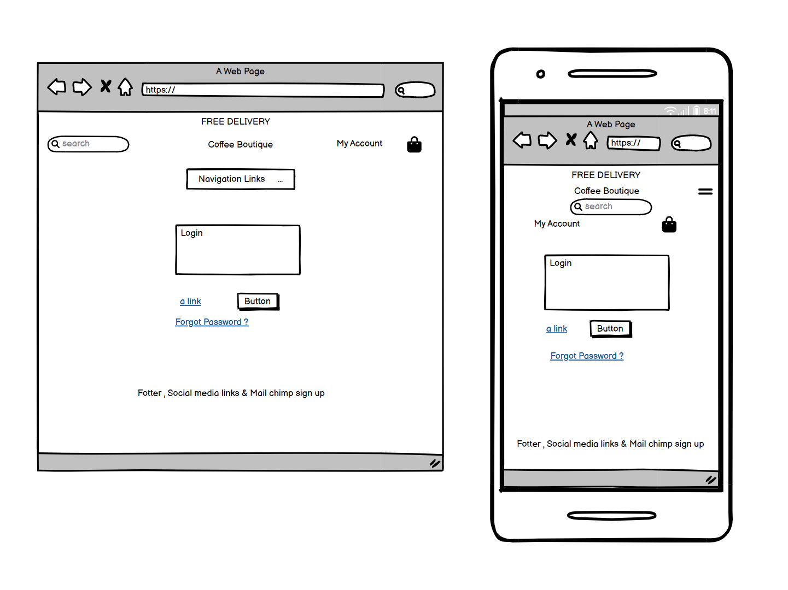
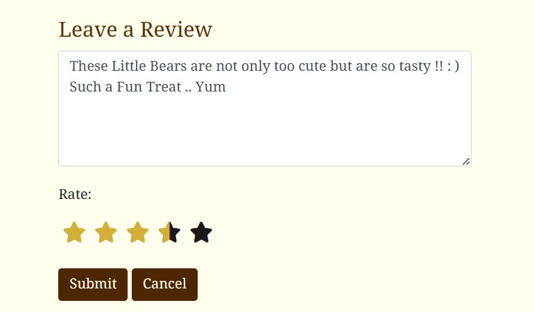
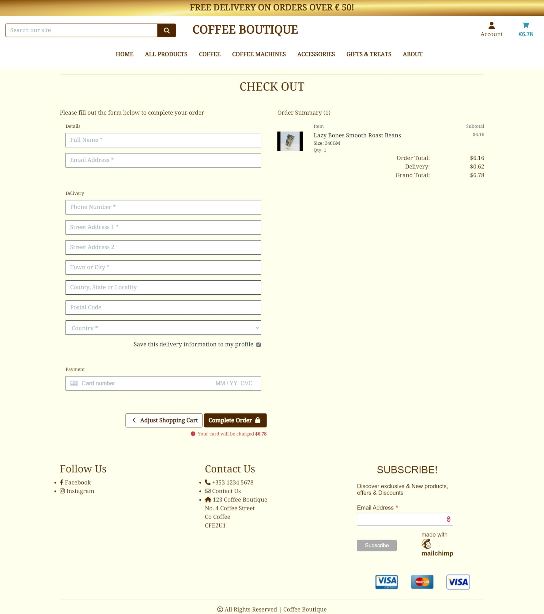
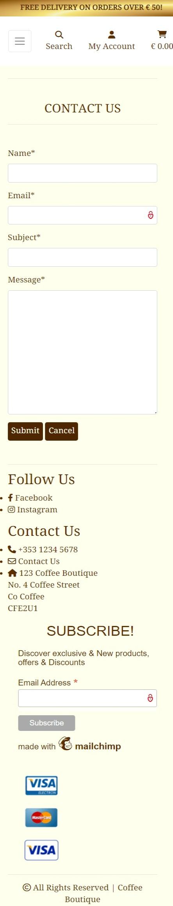

# Coffee Boutique 

Live App link : [Coffee Boutique](https://coffee-boutique.herokuapp.com/)

Git Hub Repository : [Coffee Boutique Repository](https://github.com/TaraHelberg/Coffee-Boutique)

Coffee Boutique is a online E-commerce website engaged in the selling of Coffee & associated Coffee Product. The store offers it's shoppers a wide range of Coffee as well as Coffee product such as machines, manual coffee makers, gift sets and even some treats for those with a sweet tooth.
The App is aimed at all Coffee Lovers and shows it love of Coffee in its design and colour choice.

# Contents

- [User Experience(UX)](#user-experience-ux)
   * [Scope](#scope)
   * [User Stories](#user-stories)
        * [Agile Method](#agile-method-git-projects)
        * [Future Features](#future-features) 
   * [Design](#design)
      * [Colour Scheme](#colour-scheme)
      * [Images](#images)
      * [Product Descriptions](#product-descriptions)
      * [Fixtures Categories & Products](#fixtures-categories--products)
      * [Font](#fonts)
      * [Wireframes(Balsamiq Wireframes)](#balsamiq-wireframes)
      * [Data Modal](#data-modal)
   * [Web Marketing Strategy](#web-marketing-strategy) 
      * [Search Engine Optimisation(SEO)](#search-engine-optimisation-seo)
      * [XML Sitemap](#xml-sitemap)
      * [Robots](#robots)
      * [MailChimp Newsletter](#mailchimp-newsletter)
      * [Facebook Page](#facebook-page)
   * [Security Features and Defensive Design](#security-features-and-defensive-design)
      * [User Authentication](#user-authentication)
      * [Form Validation](#form-validation)
      * [Database Security](#database-security)
      * [Custom error pages:](#custom-error-pages)

- [Features](#features)
   * [Home Page](#home-page)
   * [User Account Pages](#user-account-pages)
       * [Sign Up](#sign-up)
       * [Sign In](#sign-in)
       * [Password Reset](#password-rest)
       * [Sign Out](#sign-out)
   * [My Profile](#my-profile)    
   * [All Products Page](#all-products)
   * [Product Detail Page](#product-detail)   
   * [Favourites](#favourites-page)
   * [Shopping Cart](#shopping-cart)
   * [Secure Check Out](#secure-check-out) 
   * [Coffee Page](#coffee-1)
   * [Coffee Machines Page](#coffee-machines-1)
   * [Accessories Page](#accessories-1)
   * [Gift Sets & Treats Page](#gift-sets--treats)
   * [About Drop Down Navigation](#about)
   * [Blog Page](#blog)
   * [Blog Detail Page](#blog-detail)
   * [Contact Us Page](#contact-us)
   * [FAQ's Page](#faqs---frequently-asked-questions)
   * [Privacy Policy Page](#privacy-policy-page)
   * [Copy Right Page](#copy-right-page)
   

- [Admin](#admin)
   * [Admin Control Panel Django](#admin-control-panel-django)
   * [Admin Login](#admin-login-django)
   * [Admin Blog Django](#admin-blog-django)
   * [Admin Products Control Django](#admin-products-control-django)
        * [Admin Categories Dajngo](#admin-categories-dajngo)
        * [Admin Products Django](#admin-products-django)
        * [Admin Reviews Django](#admin-reviews-django)
   * [Admin Control Front End](#admin-control-front-end)
        * [Admin Front End Products](#admin-front-end-products)

- [Technologies](#technologies)
   * [Programming Languages](#programming-languages)
   * [Support Programs & Libraries](#support-programs--libraries)

- [Testing](#testing)
   * [Bugs](#bugs)
   * [ManualTesting](#manual-testing)
        * [NavigationHeader](#navigation-header)
        * [NavigationFooter](#navigation-footer)
      * [SignUpManualTesting](#sign-up-manual-testing)
      * [SignInManualTesting](#sign-in-manual-testing)
      * [SignOutManualTesting](#sign-out-manual-testing)  
      * [AdminControlMaualTesting](#admin-control-maual-testing)          
          * [AdminLoginMaualTest](#admin-login-maual-test)
          * [AdminControlPanelMaualTesting](#admin-control-panel-maual-testing)
                         
    * [Validation](#validator-testing)

- [Deployment](#deployment)
   * [Github](#github)
   * [Django and Heroku](#django-and-heroku)   
   * [Clone Project](#clone-project)

- [Acknowledgments](#acknowledgments)
    * [Credits](#credits)
    * [CopiedCode&CodeAssistance](#copied-code--code-assistance)
    * [Note](#note)

## User Experience UX

## Scope

As an App Developer & Designer, I have tried to incorporate the needs of the Shopper & Business Owner/Admin Manager along with a User-Friendly navigation & an aesthetically pleasing App. The App is designed for the use of anyone who Loves & wishes to purchase Coffee & Coffee Products with an easy to use check out system.

   *  Main App Goals
      +	To provide our Shoppers with a good website experience and relevant coffee content on display
      + To provide our Shoppers with a visually pleasing website that is easy to navigate.
      + To provide our Shoppers a website with a clear purpose and understanding of their needs.
      + To provide our Shopper with the correct tools allowing shopper to search for products ,leave reviews and rate the products.
      + To provide our Shopper with an easy and safe way to purchase our coffee products.
      + To provide our Shoppers with access to mailing list so that they may be informed on our coffee products.

[Back to top ⇧](#contents)

## User Stories

I have used the Agile method starting with the Epics from which the User Stories are propagated and Task required to complete the User Stories.

### Epic 1 : Navigation & Viewing 

As a Website Owner I require my Website to Have Navigation & the ability to view my products in a list form & detail. I additionally require my website to show my product Reviews, my shoppers should also have access to a Shopper Profile & shopper favourites page so that the Shoppers visiting my Website can navigate the site easily , see the products both as a list & in detail & view the product Reviews in order to make informed decisions about their purchases, Manage there personal details from a Profile page and be able to keep track of their favourite products

1.	As a Shopper I can easily navigate around the website so that I can make use of the website to it's fullest. 
2.	As a Shopper I can Navigate to & view a list of Coffee products & be able to choose accordingly so that I can see what is on offer and select what I want to purchase.
3.	As a Shopper I can Click on a Coffee product to read and view the details so that I can make an informed decision as to if this is the coffee product I want to purchase.
4.  As a Shopper I can navigate to & view specific category's of products so that quickly find products that I am interested in without looking through all the products.
5.	As a Shopper I can navigate to Coffee product Reviews so that I can read other Shopper opinions.
6.  As a Shopper I can navigate to My Favourite Products page with ease so that I can view My Favourite Products.
7.  As a Shopper I can have a Favourite Products Page so that I can see my favourite products without having to search for them again.
8.  As a Shopper I can Navigate to & View my User Profile so that I can manage my own details on & from this. - Done with User Accounts.
9.  As a user / shopper I can easily find & get to the contact page so that I can fill out a contact form.
10. As a Shopper / User I can find / navigate with ease to the frequently asked questions section so that I can find answers to common questions.
11. As a Shop Owner I can give access / navigate to the copy right statement to users so that this information is available to them for the protection of my company. 
12. Be able to  Navigate to &  Select & Read More of the Blog Post. - Epic 57 Blog Post 

### Epic 2 : Registration & User Accounts

As a Website Owner I require my Website to have a Registration Account, login & out for those accounts a password recover system the ability to send confirmation of Registration and a personal profile for those that have Registered so that shoppers visiting my Website can Register for an account , login & out of that account receive confirmation of their registration and have a personal profile to add their own details to after registration so that they may use my Website to its fullest in order to Purchase my products

1.	As a Shopper I can Register for an Account so that I am able to avail of the services offered to Registered members.
2.	As a shopper I can easily Login & Logout of my Account so that I may able able to make use off my Registered Account.
3.	As a Shopper I can Recover my Account Password easily so that should I forget it. I am able to recover it and login to my Account.
4.	As a Shopper I can receive Confirmation of my Registration via email so that I know that I have registered properly and all is in order.
5.	As a Shopper I can have a User Profile so that I can manage my own details on & from this

### Epic 3 : Review & Rate Products

As a Website Owner I require a Review section for my Products that can be updated or deleted & a rating system for my products so that shoppers can write Reviews, update and delete them should they chose to as well as been able to leave a rating of a product so that other shoppers can see what my existing customers thing of my products in order for me to see what they think , make alterations if necessary and in this way increase my product sales

1.	As a Shopper I can make a review on a Product so that I can let other shoppers know about the product I have previously brought.
2.	As a Shopper I can delete a product review I have made so that I have more control over what I review & in case I picked a wrong product or change my mind about reviewing the product.
3.	As a Shopper I can edit a product review I have made so that I have more control over what I review & in case I wish to change my mind on how I have worded my review or spot a mistake.
4.	As a Shopper I can rate & un rate a product so that I can share my view of the product as a rating as this is quicker than writing a review.

### Epic 4 : Sorting & Searching

As a Website Owner I require shoppers to be able to search for a product , sort through a list of products & product categories and see what they have searched for and how many results they have gotten so that shoppers can find the product they are looking for with ease in order to make their purchases 

1.	As a Shopper I can Search for Coffee products via name so that I can find a specific product
2.	As a Shopper I can sort through a list of available products so that I can easily & quickly find the product I am looking for.
3.	As a Shopper I can sort through the Products via categories so that I can search for the product I want under its respective category to quickly & easily find the product I want.
4.	As a Shopper I can easily what I have searched for & how many results I have gotten so that I can see the available products I have searched for and quickly find the product I want.

### Epic 5 : Purchasing & Check Out

As a Website Owner I require shoppers to have the option of selecting a product size & quantity, view what they have chosen to purchase, be able to adjust the qty of that purchase should they choose to be able to add payment information & checkout whilst feeling secure and sale. Confirmation of their order been processed and receive a confirmation email after check out so that shoppers on my website have control over the product they wish to purchase and adjust accordingly should they wish pay and checkout the items feeling safe and getting confirmation of what is happening with their purchase so that they can feel secure and happy with the process so that the shopper has control , feels safe and understands what is happening.

1.	As a Shopper I can easily select a product size & quantity so that I can chose the size & quantity of the product I wish to purchase.
2.	As a Shopper I can view what I have chosen in my shopping Cart so that I can keep track of my purchase before checkout.
3.	As a Shopper I can adjust quantity of my purchase in my shopping Cart so that I have more control over my purchase before checkout.
4.	As a Shopper I can easily fill out the payment information & use the checkout system provided so that I can purchase my selected product without any problems or undue stress.
5.	As a Shopper I can feel that my details are safe & secure so that I can give my details without worrying & complete my purchase.
6.	As a Shopper I can get confirmation that my order has been processed after checkout so that I know that the order has gone through & my purchase was successful.
7.	As a Shopper I can receive a Confirmation email for my order after I have checked out so that I know that the purchase was successful & that I have proof of purchase. 

### Epic 6 : Favourite Products

As a Website Owner I require a place for my shoppers to add / store previously purchased favourite products be able to find those again and delete products from there should they find something they like better so that my shoppers can easily find what they like from a previous shopping experience and thus purchase the product again with ease.

1.	As a Shopper I can navigate to My Favourite Products page with ease so that I can view My Favourite Products. - Navigation & Viewing Epic 1
2.  As a Shopper I can have a Favourite Products Page so that I can see my favourite products without having to search for them again. - Navigation & Viewing Epic 1
3.	As a Shopper I can easily add my favourite products so that I can find them again with ease.
4.	As a Shopper I can delete a Favourite Product so that I have more control over my favourite products and am able to make adjustments as I wish to.

### Epic 7 : Admin & Store Management

As a Website Owner I require access login & out to Admin section from the Website so that the Admin can add, update or delete products as require.

1.	As a Admin I can Login & Log out of the Admin section so that have access to an Admin section via website to perform Admin duties.
2.	As a Admin I can Add new product so that I can keep the website Products up to date.
3.	As a Admin I can Edit a Product so that I can update / edit any products on the website that might need it.
4.	As a Admin I can Delete a Product so that I can delete any products on the website that are no longer needed to keep the website up to date.
5.	Be able to add / edit / delete a Blog Post. - Epic 57 Blog Post 

### Epic 8 : Company Info

As a user / shopper I can easily find all relevant company information so that when I information from or about the company I can access it

1.  As a user / shopper I can have a contact page & fill out a contact form for Coffee Boutique so that that I can request information or assistance as need.
2.  As a user / shopper I can easily find & get to the contact page so that I can fill out a contact form.  - Epic 1 : Navigation & Viewing 
3.  As a Shop Owner I can have a company copy right statement so that my company website content is secure.
4.  As a Shop Owner I can give access / navigate to the copy right statement to users so that this information is available to them for the protection of my company - Epic 1 : Navigation & Viewing 
5.  As a Shop Admin / User I can have a list of frequently asked questions so that shoppers / users can get answers to questions that are asked often.
6.  As a Shopper / User I can find / navigate with ease to the frequently asked questions section so that I can find answers to common questions.  - Epic 1 : Navigation & Viewing 

### Epic 9 : Blog Post 

As a Shop Admin I can Add , Update & Delete articles Blog Post so that I can keep my customers engaged, supply updates and direct them to interesting coffee information

1. As a Shop Admin I can Add , Update & Delete articles Blog Post so that I can keep my customers engaged, supply updates and direct them to interesting coffee information.
2. Be able to  Navigate to & Select & Read More of the Blog Post.

[Back to top ⇧](#contents)

## Agile Method Git Projects

GitHub projects was used to manage the development process using an agile approach. Please see link to project [Kanban Board](https://github.com/TaraHelberg/Coffee-Boutique/issues?q=is%3Aissue+is%3Aclosed)

Not all Epics / User Stories have made it into the project using the MSCW Method you will find on the Kanban Must have’s, Should Have’s, Could Have's and Won’t have labels. 
The won’t have labelled sections are those that did not make it into the App due to time constraint

[Back to top ⇧](#contents)

## Future Features

Although only a few are represented in the Kanban the E-commerce store that I have made has loads of potential for numerous extra features and futher development and I will be honest and say that if I put in all my Future features in that I could think of this readme would be extensive :)

1. User Story: Product Image to Expand on Hover Over

   As a Shop Owner I can give my Shoppers a better look at the Product when they hover over the Product it expands and shows more detail so that my shoppers / users can see the product in more detail possibly making them purchase it as it gives them a better idea of the products.

2. User Story: Product Price Change on Selection of Size

   As a Shop Owner I can have the price of my products change if the product has a size & that size is selected the price either decreases or increases accordingly so that when a Shopper / User selects a size on the product they are given the accurate price according to size and my company gets paid the correct price for the product.

 3. Epics : Discount Coupon

    As a Shop Owner I require to give Discount Coupons that a Shopper can see & use so that it encourages shoppers / user to make that first purchase.

 Other Future Features include using Product variants to manage not only the change in Price for size difference but for product colour selection.

 The abitity to make up your own Gift set by selecting from excisting Products.

 Getting a weekly mailing list of Discounts , New products and interesting Blog Post to those who have subscribed to the mailing list.

 This is to name just a few.   

[Back to top ⇧](#contents)

# Design

## Colour Scheme

As I decided to do my e-commerce app on Coffee & Coffee Products as a Coffee Lover myself I decided to go with tradional colours that are associated with coffee and complement each other natrualy.
Chooseing to got with a Main text color of Coffee , Background colour of cream and for enhancment and effect Gold for the Deliver Banner and hover / button colour changes.
White text has been used where applicable for visablity.

It was decided that when in use the Shopping cart icon had a very distinct in use color.

It was also decide that in the Blog for external links & content credit links that they have a color of there own so as to be more visabile.

[Back to top ⇧](#contents)

## Images

### Images Credit for Project

 

Images

* [Product Images obtained via Code Institute](https://learn.codeinstitute.net/)
    + Image 1  . [noimage](https://github.com/Code-Institute-Solutions/boutique_ado_images/tree/master/pics)
          
* [Product Images obtained via Freepik.com](https://www.freepik.com/)
    + Image 1  . [mildly-blue-coffee-ground-light-roast](https://www.freepik.com/free-psd/paper-coffee-bag-branding-mockup_32418528.htm#query=coffee%20bag%20mockup&position=4&from_view=search&track=ais)
    + Image 2  . [cheeky-moco-coffee-ground-fine-roast](https://www.freepik.com/free-psd/glossy-foil-coffee-bag-packaging-mockup_29072572.htm#query=coffee%20bag%20mockup&position=19&from_view=search&track=ais)
    + Image 3  . [wonderfully-wild-coffee-ground-classic-roast](https://www.freepik.com/free-psd/coffee-pouch-packaging-mockup-front-view_34981719.htm#query=coffee%20bag%20mockup&position=2&from_view=search&track=ais)
    + Image 4  . [gray-day-pick-up-coffee-ground-fine-roast](https://www.freepik.com/free-psd/kraft-paper-coffee-bag-packaging-mockup_32469423.htm#query=coffee%20packaging%20mockup&position=25&from_view=search&track=ais)
    + Image 5  . [perky-pink-coffee-ground-hand-roast](https://www.freepik.com/free-psd/glossy-paper-coffee-bag-packaging-mockup_32417142.htm#query=coffee%20packaging%20mockup&position=33&from_view=search&track=ais)
    + Image 6  . [all-about-you-coffee-ground-medium-roast](https://www.freepik.com/free-psd/glossy-foil-coffee-bag-packaging-mockup_29813447.htm#query=coffee%20bag%20mockup&position=28&from_view=search&track=ais)
    + Image 7  . [golden-goddess-coffe-ground-medium-dark-roast](https://www.freepik.com/free-psd/glossy-metal-coffee-jar-packaging-mockup_25603323.htm#page=2&query=coffee%20bag%20mockup&position=14&from_view=search&track=ais)
    + Image 8  . [brazen-bronze-coffee-grounds-dark-roast](https://www.freepik.com/free-psd/glossy-paper-coffee-bag-with-tag-label-packaging-mockup_29594159.htm#page=2&query=coffee%20bag%20mockup&position=24&from_view=search&track=ais)
    + Image 9  . [rambunctious-red-coffee-ground-medium-dark-roast](https://www.freepik.com/free-psd/kraft-paper-coffee-bag-with-tag-label-branding-mockup_29594114.htm#page=2&query=coffee%20bag%20mockup&position=28&from_view=search&track=ais) 
    + Image 10 . [vivaciously-vanilla-coffee-grounds-fine-roast](https://www.freepik.com/free-psd/glossy-paper-coffee-bag-packaging-mockup_32704249.htm#page=2&query=coffee%20bag%20mockup&position=9&from_view=search&track=ais)
    + Image 11 . [rearing-to-go-coffee-beans-robust-roast](https://www.freepik.com/free-psd/glossy-paper-coffee-bag-branding-mockup_29813265.htm#query=coffee%20bean%20bag%20mockup&position=13&from_view=search&track=ais)
    + Image 12 . [perky-pink-coffee-beans-hand-roast](https://www.freepik.com/free-psd/glossy-paper-coffee-bag-packaging-mockup_32417116.htm#query=coffee%20bean%20bag%20mockup&position=20&from_view=search&track=ais)
    + Image 13 . [out-of-this-world-coffee-beans-organic-roast](https://www.freepik.com/free-psd/kraft-paper-coffee-bag-branding-mockup_28193651.htm#query=coffee%20bean%20bag%20mockup&position=27&from_view=search&track=ais)
    + Image 14 . [all-about-you-coffee-beans-medium-roast](https://www.freepik.com/free-psd/glossy-foil-coffee-bag-packaging-mockup_29813446.htm#query=coffee%20bean%20bag%20mockup&position=28&from_view=search&track=ais)
    + Image 15 . [lazy-bones-coffee-beans-smooth-roast](https://www.freepik.com/free-psd/packaging-mockup-coffee-shop-psd_8019958.htm#query=coffee%20bean%20bag%20mockup&position=36&from_view=search&track=ais)
    + Image 16 . [wide-awake-coffee-beans-classic-roast](https://www.freepik.com/free-psd/coffee-bags-mockup-gravity-psd_7587411.htm#query=coffee%20bean%20bag%20mockup&position=47&from_view=search&track=ais)
    + Image 17 . [dangerous-darkblue-coffee-bean-dark-roast](https://www.freepik.com/free-psd/paper-coffee-bag-packaging-mockup_27715027.htm#page=2&query=coffee%20bean%20bag%20mockup&position=1&from_view=search&track=ais)
    + Image 18 . [mildly-blue-coffee-beans-light-roast](https://www.freepik.com/free-psd/paper-coffee-bag-branding-mockup_32418503.htm#page=2&query=coffee%20bean%20bag%20mockup&position=10&from_view=search&track=ais)
    + Image 19 . [gray-day-pick-up-coffee-beans-fine-roast](https://www.freepik.com/free-psd/kraft-paper-coffee-bag-packaging-mockup_32469417.htm#page=2&query=coffee%20bean%20bag%20mockup&position=21&from_view=search&track=ais)
    + Image 20 . [golden-goddess-coffe-beans-medium-dark-roast](https://www.freepik.com/free-psd/glossy-foil-coffee-pouch-bag-branding-mockup_31027419.htm#page=3&query=coffee%20bean%20bag%20mockup&position=8&from_view=search&track=ais)
    + Image 21 . [in-a-blink-blue-coffee-capsule-pod](https://www.freepik.com/free-psd/coffee-capsule-mockup_9054756.htm#query=coffee%20pods&position=0&from_view=search&track=sph)
    + Image 22 . [charging-cappuccino-coffee-capsule-pod](https://www.freepik.com/free-photo/top-view-coffee-capsules_13661702.htm#page=2&query=coffee%20capsule%20mock%20up&position=36&from_view=search&track=ais)
    + Image 23 . [mighty-mochaccino-coffee-capsule-pod](https://www.freepik.com/free-photo/top-view-coffee-beans-coffee-capsules_13661696.htm#page=9&query=coffee%20capsule%20mock%20up&position=16&from_view=search&track=ais)
    + Image 24 . [vibrant-vanilla-coffee-capsule-pod](https://www.freepik.com/free-photo/top-view-coffee-beans-coffee-capsules_13661694.htm#page=18&query=coffee%20capsule%20mock%20up&position=27&from_view=search&track=ais)
    + Image 24 . [white-coffee-mug-with-hello-friday-on-wooden-table-green-plant](https://www.freepik.com/free-psd/cup-mockup-with-floral-decoration_1258228.htm#query=mugs&position=34&from_view=search&track=sph)
    + Image 26 . [two-mugs-one-blue-one-green-on-white-background](https://www.freepik.com/free-psd/two-mugs-white-background-mockup_19196951.htm#query=mugs&position=40&from_view=search&track=sph)
    + Image 27 . [black-coffee-cup-white-inner-white-background-coffeebeans](https://www.freepik.com/free-photo/coffee-cup-beans-white-background_1007883.htm#query=coffee%20mug&position=9&from_view=search&track=sph)
    + Image 28 . [white-coffee-mug-with-saying-rise-up-and-attack-the-day-with-enthusiasm-wooden-table-with-chocolate-filled-pastry](https://www.freepik.com/free-psd/breakfast-mockup-with-croissants_1312889.htm#query=coffee%20mug&position=12&from_view=search&track=sph)
    + Image 29 . [white-coffee-cup-plate-on-wooden-table](https://www.freepik.com/free-photo/tasty-coffee-white-cup_977687.htm#query=coffee%20mug&position=19&from_view=search&track=sph)
    + Image 30 . [artistic-cream-green-black-coffee-mug](https://www.freepik.com/free-photo/cozy-cup-tea_9435279.htm#query=coffee%20mug%20rustic&position=10&from_view=search&track=ais)
    + Image 31 . [espresso-glass-steel-base-and-handle-white-background-coffeebeans](https://www.freepik.com/free-photo/coffee-cup_6189972.htm#query=coffee%20esspresso%20cups&position=8&from_view=search&track=ais)
    + Image 32 . [traditional-bronze-turkish-arabic-coffee-glass-one-wooden-desk](https://www.freepik.com/free-photo/traditional-turkish-arabic-tea-glass-one-wooden-desk_4029661.htm#query=esspresso%20cups&position=35&from_view=search&track=ais)
    + Image 33 . [three-cups-espresso-sea-shell-decorated-on-wooden-board](https://www.freepik.com/free-photo/three-cups-espresso-wooden-board_14202267.htm#page=2&query=esspresso%20cups&position=21&from_view=search&track=ais)
    + Image 34 . [diamond-triangle-patern-black-ceramic-cup-black-plate-white-ceramic-cup-white-plate-on-warm-wooden-table](https://www.freepik.com/free-photo/close-up-picture-black-ceramic-cup-black-plate-white-ceramic-cup-white-plate-is-brown-table_10478103.htm#page=3&query=esspresso%20cups&position=41&from_view=search&track=ais)
    + Image 35 . [glass-stainless-steel-french-press](https://www.freepik.com/free-vector/stainless-steel-machines-tea-coffee_11058481.htm#query=french%20press%20mock%20up&position=6&from_view=search&track=ais)
    + Image 36 . [glass-brozen-french-press](https://www.freepik.com/free-photo/black-tea-table_7734431.htm#query=french%20press%20coffee&position=12&from_view=search&track=ais)
    + Image 37 . [beautiful-side-transparent-chrome-drip-coffee-maker-with-roasted-filtered-coffee-isolated-thick-wooden-table-cafe-shop-white-weights-steam-brutal](https://www.freepik.com/free-photo/beautiful-side-transparent-chrome-drip-coffee-maker-with-roasted-filtered-coffee-isolated-thick-wooden-table-cafe-shop-white-weights-steam-brutal_11621781.htm#query=french%20press%20coffee&position=27&from_view=search&track=ais)
    + Image 38 . [glass-stainless-steel-maze-pattern-french-press](https://www.freepik.com/free-photo/hot-tea-glass-teapot_7540226.htm#query=french%20press%20coffee&position=32&from_view=search&track=ais)
    + Image 39 . [glass-pour-coffee-maker-manual-drip-brewer](https://www.freepik.com/free-photo/coffee-maker-machine-table_13661642.htm#query=french%20press%20coffee&position=43&from_view=search&track=ais)
    + Image 40 . [coffee-moka-pot-red-aluminium](https://www.freepik.com/free-psd/coffee-shop-moka-pot-icon-isolated-3d-render-illustration_28991098.htm#query=moka%20pot&position=4&from_view=search&track=sph)
    + Image 41 . [mini-coffee-moka-pot-high-gloss-stainless-steel-coffee-beans-hesian-bag](https://www.freepik.com/free-photo/coffee-composition-with-moka-pot-bag_1264959.htm#query=moka%20pot&position=26&from_view=search&track=sph)
    + Image 42 . [coffee-moka-pot-aluminium-top-red-bottom-silver-with-three-red-blue-yellow-cups-on-table](https://www.freepik.com/free-photo/italian-mocca-coffee-with-cups-table_35817710.htm#query=moka%20pot&position=19&from_view=search&track=sph)
    + Image 43 . [mini-coffee-moka-pot-matted-stainless-steel](https://www.freepik.com/free-photo/preparing-breakfast_3994961.htm#page=3&query=coffee%20moka%20pot&position=12&from_view=search&track=ais)
    + Image 44 . [coffee-moka-pot-green-aluminium-lid-open](https://www.freepik.com/free-photo/high-angle-coffee-pot-arrangement_12670138.htm#page=2&query=coffee%20french%20press&position=39&from_view=search&track=ais)
    + Image 45 . [gift-set-drippingly-grand-small-metal-coffee-pot-glass-drip-pot-filter-drip-stand-wooden-bar-counter](https://www.freepik.com/free-photo/close-up-coffee-brewing-gadgets-wooden-bar-counter_8225456.htm#page=2&query=coffeee%20french%20press&position=31&from_view=search&track=ais)
    + Image 46 . [gift-set-fully-loaded-glass-drip-pot-bronze-coffe-pot-milk-jug-and-hand-grinder-glass-cup-white-ceramic-leaf-sauce-ramekin-wooden-cup-place-holder-small-wood-spoon-storage](https://www.freepik.com/free-photo/equipment-coffee-maker-barista_4695472.htm#page=3&query=coffeee%20french%20press&position=49&from_view=search&track=ais)
    + Image 47 . [gift-set-grindingly-good-blue-cup-on-plate-wooden-coffee-grinder-with-freshly-ground-coffee-scattered-coffee-beans](https://www.freepik.com/free-photo/cup-coffee-with-freshly-ground-coffee_903419.htm#page=5&query=coffeee%20french%20press&position=25&from_view=search&track=ais)
    + Image 48 . [gift-set-moka-up-bag-of-coffee-silver-spoon-metal-moka-coffee-brewer-white-mug](https://www.freepik.com/free-photo/arrangement-coffee-grinder-with-sack-mug-front-view_6918144.htm#page=6&query=coffeee%20french%20press&position=21&from_view=search&track=ais)
    + Image 49 . [gift-set-on-the-go-cardboard-fold-down-lid-box-white-with-design-bottom-of-bag-of coffee-beans-to-go-ceramic-white-mug-lid-milkly-coffee](https://www.freepik.com/free-psd/glossy-paper-coffee-bag-packaging-mockup_32704209.htm#query=coffee%20bags&position=41&from_view=search&track=sph)
    + Image 50 . [gift-set-the-traditional-hessian-sack-bag-of-coffee-beans-with-scattered-coffee-beans](https://www.freepik.com/free-photo/sack-with-scattered-coffee-beans_4870120.htm#page=3&query=coffee%20bags&position=3&from_view=search&track=sph)
    + Image 51 . [treat-oatmeal-chocolate-coffee-cookies-mixture](https://www.freepik.com/free-photo/oatmeal-chocolate-cookies-mixture-top-view_7101401.htm#query=biscuits&from_query=buscuits&position=5&from_view=search&track=sph)
    + Image 52 . [treat-coffee-crunch-chocolate-coated-cookies-overhead-shot-on-oven-tray](https://www.freepik.com/free-photo/overhead-shot-chocolate-cookies-oven-tray_7848264.htm#query=biscuits&from_query=buscuits&position=12&from_view=search&track=sph)
    + Image 53 . [treat-chocolate-chip-cookies-stacked-on-wooden-board](https://www.freepik.com/free-photo/chocolate-cookies-arrangement-with-copy-space_9906866.htm#query=biscuits&from_query=buscuits&position=25&from_view=search&track=sph)
    + Image 54 . [treat-delicious-chocolate-assortment](https://www.freepik.com/free-photo/close-up-view-delicious-chocolate-assortment_8327563.htm#page=2&query=chocolate&position=4&from_view=search&track=sph)
    + Image 55 . [treat-dusky-pink-french-coffee-macaroons-with-coffee-beans](https://www.freepik.com/free-photo/french-macaroons-with-coffee-beans_13340609.htm#query=chocolate%20coffee&position=44&from_view=search&track=sph)
    + Image 56 . [treat-chocolate-brownies-sackcloth-coffee-beans-wooden-table](https://www.freepik.com/free-photo/chocolate-brownies-sackcloth-coffee-beans-wooden-table_7675221.htm#query=brownies&position=13&from_view=search&track=sph)
    + Image 57 . [treat-cuppachino-cupcakes-mixed-with-chocolate-chip-white-plate](https://www.freepik.com/free-photo/banana-cupcakes-mixed-with-chocolate-chip-white-plate_7675227.htm#query=coffee%20muffins&position=2&from_view=search&track=sph)
    + Image 58 . [treat-chocolate-covered-mini-coffee-cakes](https://www.freepik.com/free-photo/fresh-chocolate-mini-cakes_2954822.htm#query=coffee%20truffels%20chocolate&position=31&from_view=search&track=ais)
    + Image 59 . [treat-chocolate-truffles-cocoa-powder-top-view-plate](https://www.freepik.com/free-photo/top-view-plate-with-chocolate-candy-cocoa-powder_8621610.htm#query=coffee%20truffels%20chocolate&position=29&from_view=search&track=ais)
    + Image 60 . [treat-choco-chino-biscuit-bears-hot-chocolate-tray](https://www.freepik.com/free-photo/biscuit-bears-hot-chocolate-tray_3075452.htm#page=2&query=coffee%20truffels%20chocolate&position=2&from_view=search&track=ais)

* [Product Images obtained via Hiclipart.com](https://www.hiclipart.com/)
    + Image 1  . [galloping-gold-coffee-capsule-pod](https://www.hiclipart.com/free-transparent-background-png-clipart-cjwar/download?height=200)
    + Image 2  . [galvanizing-green-coffee-capsule-pod](https://www.hiclipart.com/free-transparent-background-png-clipart-xgsrq/download?height=200)
    + Image 3  . [blazing-blue-coffee-capsule-pod](https://www.hiclipart.com/free-transparent-background-png-clipart-ldxbm/download?width=200)
    + Image 4  . [brazen-bronze-coffee-capsule-pod](https://www.hiclipart.com/free-transparent-background-png-clipart-nserb/download?width=200)

* [Product Images obtained via Pexels.com](https://www.pexels.com/)    
    + Image 1  . [classy-classic-coffee-capsule-pod](https://www.pexels.com/photo/collection-of-capsules-for-coffee-machine-4226867/)
    + Image 2  . [cheeky-cherry-choco-coffee-capsule-pod](https://www.pexels.com/photo/coffee-capsules-in-close-up-photography-10320269/)

* [Product Images obtained via Pngimg.com](https://pngimg.com/)     
    + Image 1  . [genio-touch-pod-coffee-capsule-pod-machine](https://pngimg.com/image/17264)
    + Image 2  . [gusto-pod-coffee-capsule-pod-machine-red](https://pngimg.com/image/17277)
    + Image 3  . [happy-pod-coffee_capsule-pod-machine-silver-and-black](https://pngimg.com/image/17292)
    + Image 4  . [my-way-pod-coffee-capsule-machine-black](https://pngimg.com/image/17299)
    + Image 5  . [vivy-pod-coffee-capsule-pod-machine-silver](https://pngimg.com/image/17312)
    + Image 6  . [coffee-filter-pot-machine-i-belong-black-10-cups](https://pngimg.com/image/17268)
    + Image 7  . [coffee-machine-full-touch-colorful-visual-screen-cappuccino-latte-fully-automatic-with-milk-frother-silver](https://pngimg.com/image/17260)
    + Image 8  . [coffee-machine-nescafe-alergria-red-and-silver](https://pngimg.com/image/17258)
    + Image 9  . [coffee-machine-cappuccino-automatic-bean-to-cup-with-auto-milk-silver](https://pngimg.com/image/17263)
    + Image 10 . [coffee-machine-Just-4-u-next-gen-premium-class-silver-two-milk-coffee-milk-cups](https://pngimg.com/image/17272)
    + Image 11 . [coffee-filter-pot-machine-easy-me-10-cups](https://pngimg.com/image/17287)
    + Image 12 . [coffee-machine-faema-x30-milkps-single-step-super-automatic-espresso-machine-top-load-beans-chocolate-powder-digital-screen-interface-silver-and-black](https://pngimg.com/image/102182)
    + Image 13 . [coffee-machine-full-touch-colorful-visual-screen-cappuccino-latte-fully-automatic-with-milk-frother-silver](https://pngimg.com/image/102183)
    + Image 14 . [coffee-machine-kalea-plus-silver-and-black-3-top-loade-beans-chocolate-poweder-milk-powder](https://pngimg.com/image/102194)
    + Image 15 . [coffee-machine-delonghi-la-specialista-prestigio-bean-to-cup-silver-black](https://pngimg.com/image/102206)
    + Image 16 . [espresso-coffee-machine-russel-hobbs-milk-frother-black-and-silver](https://pngimg.com/image/17261)
    + Image 17 . [espresso-coffee-machine-rise-and-shine-milk-frother-siler-black-trim](https://pngimg.com/image/17274)
    + Image 18 . [espresso-coffee-machine-gaggia-milk-frother-stainless-steel](https://pngimg.com/image/17289)
    + Image 19 . [espresso-coffee-machine-happiness-is-milk-frother-silver-with-black-trim](https://pngimg.com/image/17298)
    + Image 20 . [espresso-coffee-machine-jura-milk-frother-black-with-silver-trim](https://pngimg.com/image/17303)
    
 

[Back to top ⇧](#contents) 

## Product Descriptions

### Coffee

Coffee - Beans, Grounds & Pods descriptions : Names of the Coffees are made up as are the descriptions, having re-searched, read and drunk a lot of Coffee myself, been an avid Coffee Lover. The descriptions use the standard format of how I have seen coffee described.

[Back to top ⇧](#contents)

### Coffee Machines

Coffee Machines - Capsule Pod, Coffee Makers & Espresso : Here I had to use product descriptions from a number of online resources as I felt for authenticity that a better description of the actual product was require than that which I could make up myself. I have tried to match the description as closely to the free product image I was able to obtain, however in some case the product image and the product description link are slightly different but as close as I could find. 

Names in these have been altered on certain products to suite the product pictures which I was able to obtain from free image sites, however product images that have very clear product names have been kept the same or altered only slightly.

Please find below links to the descriptions I have used.

Description Links

+ [Happy Pod Coffee Machine](https://www.very.ie/tassimo-tas1007gb-happy-pod-coffee-machine-cream/1600355406.prd?sku=sku21407087&msclkid=f03a39bae9551f26480b5a7f8e5ec7dd)

+ [My Way Pod Coffee Machine](https://www.very.ie/tassimo-tas6502gb-my-way-pod-coffee-machine-black/1600419793.prd?sku=sku22011080&msclkid=42ca86ca62a51cc5fb10e50f05aed0f8)

+ [Vivy Pod Coffee Machine](https://www.very.ie/tassimo-tassimo-tas1406gb-vivy-pod-coffee-machine-grey/1600562473.prd?sku=sku24191513&msclkid=9d5c37db4202152f1916541e2509fbc6)

+ [Gusto Pod Coffee Machine](https://www.very.ie/nescafe-dolce-gusto-nescafe-dolce-gusto-infinissima-coffee-machine-red/1600737254.prd?sku=sku24878820&msclkid=39b4faaa98051783a11e996fee1483ce)

+ [Genio Touch Pod Coffee Machine](https://kaffekapslen.ie/genio-touch-black-dolce-gusto.html?msclkid=afdebba243a419af1983d8673cf8a4c3&utm_source=bing&utm_medium=cpc&utm_campaign=IE%20-%20S-Bing%20Shopping%20-%20Maskiner%20(200%25)&utm_term=4585994283994555&utm_content=Maskiner)

+ [Coffee Filter Pot Machine - LCD - permanent filter - 1.5 L](https://www.expondo.ie/royal-catering-coffee-machine-lcd-permanent-filter-1-5-l-10011890?msclkid=f4545464123a1aa645ff37a191c740cc&utm_source=bing&utm_medium=cpc&utm_campaign=%28ie%29%20Standard%20Shopping%20Catch%20All%20%5BPLA%5D&utm_term=4576236138127071&utm_content=Gastronomy)

+ [I Belong Filter Pot Machine - 10 Cups](https://coffeemachinepro.co.uk/product/icm16210-bk/)

+ [Easy Me Filter Pot Machine - 10 Cups](https://coffeemachinepro.co.uk/product/icm15210-1/)

+ [Nescafe Alergria Coffee Machine](https://www.nestleprofessional.com.sg/nescafe/nescafe-alegria-solutions-a860)

+ [Cappuccino, Automatic Bean to Cup Coffee Machine, with Auto Milk](https://www.very.ie/delonghi-eletta-cappuccino-automatic-bean-to-cup-coffee-machine-with-auto-milk-nbspecam44660b/1410188143.prd?sku=sku15881602&msclkid=6d159c9759ad1c0ec38bff52ca429166)

+ [Just 4 U Next Gen Premium Class Coffee Machine - Silver](https://www.very.ie/jura-jura-e8-coffee-machine-silver/1600825456.prd?sku=sku25749450&msclkid=6d48bdacdb9b10f2d8efde694e0cc2ea)

+ [Faema X30 MILKPS Single Step - Super-Auntomatic Esspresso Coffee Machine](https://mrespresso.com/product/faema-x30-milkps-single-step/)

+ [Full Touch Colorful Visual Screen Cappuccino Latte Fully Automatic Coffee Machine with Milk Frother](https://www.colet-coffeemachines.com/products/clt-s8-one-touch-cappuccino-coffee-machine.html)

+ [Kalea Plus Coffee Machine](https://necta.evocagroup.com/en/products/coffee-machines/kalea-plus)

+ [DeLonghi La Specialista Prestigio, Bean to Cup Coffee Machine, Silver & Black](https://www.very.ie/delonghi-la-specialista-prestigio-bean-to-cup-coffee-machine-ec9355m-silverblack/1600618492.prd?crossSellType=item_page.recs_1)

+ [Russel Hobbs Espresso Coffee Machine - Milk Frother - Balck & Silver](https://www.vijaysales.com/russell-hobbs-190713a-espresso-coffee-machine-15-bar/16172)

+ [Rise & Shine Espresso Coffee Machine -Milk Frother - Silver - Black Trim](https://www.fruugo.ie/donlim-dl-kf5400-coffee-machine-espresso-espresso-household-semi-automatic-20bar-high-pressure-extraction/p-118631085-249304754?language=en&ac=bing&msclkid=7ad47828dbec1bd7fc0d1bee845d767b&utm_source=bing&utm_medium=cpc&utm_campaign=All_IE&utm_term=4575411486830268&utm_content=Ad%20group%20%231)

+ [Gaggia Espresso Machine - Milk Frother - Stainless Steel](https://www.houzz.com/products/gaggia-classic-espresso-machine-prvw-vr~4275902)

+ [Jura Espresso Machine - Milk Frother - Black - Silver Trim](https://uk.jura.com/en/homeproducts/automatic-coffee-machines/E8-Piano-Black-INTA-15372)

+ [Happiness Is Espresso Machine - Milk Frother - Silver - Balck Trim](https://donaghybros.ie/delonghi-ec685-bk-dedica-manual-espresso-coffee-maker-black.html?msclkid=308b3194fd0c14c29b705252972ad743&utm_source=bing&utm_medium=cpc&utm_campaign=IE-Search-DSA%20(10%25%20CoS)&utm_term=donaghybros&utm_content=IE-DSA-Pages-All)

[Back to top ⇧](#contents)

### Accessories

Drink Wears Products - Names & Descriptions are made up as to how I felt they should be described to my Shoppers.

Manual Coffee Makers : Here I had to use product descriptions from a number of online resources as I felt for authenticity that a better description of the actual product was require than that which I could make up myself.
Names in these have been altered to suite the product pictures which I was able to obtain from free image sites.

Please find below links to the descriptions I have used.

Description Links

+ [Glass & Chrome Manual Drip Coffee Pot Brewer ,400ml](https://www.fruugo.ie/home-pour-over-coffee-brewer-hand-drip-coffee-maker-pot400ml/p-83968085-173187873?language=en&ac=bing&msclkid=8936619058ce127504cd025501db36ea&utm_source=bing&utm_medium=cpc&utm_campaign=All_IE&utm_term=4575411486830268&utm_content=Ad%20group%20%231)

+ [Moka Pot Red & Silver, Stovetop, 300ml](https://www.fruugo.ie/300ml-moka-pot-italian-coffee-machine-espresso-aluminum-geyser-coffee-maker-kettle-latte-stove-classic-coffeeware-barista-accessories/p-66816887-134170820?language=en&ac=bing&msclkid=9b0db345237e11f03332d0807d4ce224&utm_source=bing&utm_medium=cpc&utm_campaign=All_IE&utm_term=4575411486830268&utm_content=Ad%20group%20%231)

+ [Moka Pot Green Aluminium, Stovetop, 300ml](https://www.fruugo.ie/300ml-moka-pot-italian-coffee-machine-espresso-aluminum-geyser-coffee-maker-kettle-latte-stove-classic-coffeeware-barista-accessories/p-66816887-134170820?language=en&ac=bing&msclkid=9b0db345237e11f03332d0807d4ce224&utm_source=bing&utm_medium=cpc&utm_campaign=All_IE&utm_term=4575411486830268&utm_content=Ad%20group%20%231)

+ [Moka Pot Red Aluminium, Stovetop, 300ml](https://www.fruugo.ie/300ml-moka-pot-italian-coffee-machine-espresso-aluminum-geyser-coffee-maker-kettle-latte-stove-classic-coffeeware-barista-accessories/p-66816887-134170820?language=en&ac=bing&msclkid=9b0db345237e11f03332d0807d4ce224&utm_source=bing&utm_medium=cpc&utm_campaign=All_IE&utm_term=4575411486830268&utm_content=Ad%20group%20%231)

+ [French Press Glass & Bronze , 1000ml](https://www.walmart.com/ip/French-Press-Coffee-Maker-Tea-Pot-Heat-Retention-Double-Wall-Glass-Beaker-Stainless-Steel-Filter-8-Cup-34OZ-1L-Coffee-Tea-Press-Maker-Bronze/681737113)

+ [Glass Pour Manual Drip Coffee Drewer](https://www.fruugo.ie/pour-coffee-maker800ml-manual-coffee-dripper-brewer/p-97756916-205542577?language=en&ac=bing&msclkid=3cd5e279fd541d6f877881bcae8c4e38&utm_source=bing&utm_medium=cpc&utm_campaign=All_IE&utm_term=4575411486830268&utm_content=Ad%20group%20%231)

+ [French Press Glass & Stainless Steel, 1000ml](https://www.fruugo.ie/french-press-coffee-maker34-ozheat-resistant-borosilicate-glass/p-132578490-279376082?language=en&ac=bing&msclkid=8565bd84e998176b1554de4189a7d311&utm_source=bing&utm_medium=cpc&utm_campaign=All_IE&utm_term=4575411486830268&utm_content=Ad%20group%20%231)

+ [French Press Glass & Maze Pattern Stainless Steel, 1000ml](https://www.fruugo.ie/french-press-coffee-maker34-ozheat-resistant-borosilicate-glass/p-132578490-279376082?language=en&ac=bing&msclkid=8565bd84e998176b1554de4189a7d311&utm_source=bing&utm_medium=cpc&utm_campaign=All_IE&utm_term=4575411486830268&utm_content=Ad%20group%20%231)

+ [Mini Moka Pot High Gloss Stainless Steel, Stovetop, 150ml](https://www.fruugo.ie/stainless-steel-moka-coffee-maker-mocha-espresso-latte-stovetop-filter-coffee-pot-percolator-tools/p-115417342-242854249?language=en&ac=bing&msclkid=3d121938381614428fad7afd635528f5&utm_source=bing&utm_medium=cpc&utm_campaign=All_IE&utm_term=4575411486830268&utm_content=Ad%20group%20%231)

+ [Mini Moka Pot Matted Stainless Steel, Stovetop, 150ml](https://www.fruugo.ie/stainless-steel-moka-coffee-maker-mocha-espresso-latte-stovetop-filter-coffee-pot-percolator-tools/p-115417342-242854249?language=en&ac=bing&msclkid=3d121938381614428fad7afd635528f5&utm_source=bing&utm_medium=cpc&utm_campaign=All_IE&utm_term=4575411486830268&utm_content=Ad%20group%20%231)

[Back to top ⇧](#contents)

### Gifts & Treats

Gift Sets Products - Names & Descriptions are made up as to how I felt they should be described to my Shoppers.

Treats Products - Names & Descriptions are made up as to how I felt they should be described to my Shoppers.

[Back to top ⇧](#contents)

## Fixtures Categories & Products

Fixtures are used to loaddata of Catergories & Products in the development of this site.
The fixture json files are used and modified from the Walkthrough Boutique Ado as I was unable to find a dataset to use that suited this websites theme.

[Back to top ⇧](#contents)

## Fonts

The font 'Noto Serif Toto' is used as our main Body Font for the App. The Font is imported via Google Fonts. Sans Serif is the backup font, in case for any reason the main font isn't being imported into the site correctly.

[Back to top ⇧](#contents)

# Balsamiq Wireframes

Wireframes are extremely basic and did not incorporate all App pages. Wireframes were used as boiler plates to start the app design many updates and alterations have been made after the basic Wireframes were used to get started on the App.

Balsamiq Wireframes

Home Page 

Register 

Login 

LogOut 

Products Page 

Product Detail Page 

Add Product Page 

Edit Product Page 

Favourites Page 

ShoppingCart Page 

CheckOut Page 

[Back to top ⇧](#contents)

# Data Modal

I used principles of Object-Oriented Programming throughout this project and Django’s Function-Based Views.  

Django AllAuth was used for the user authentication system.

The diagram below details the 

Database Flow Chart:

[Back to top ⇧](#contents)

# Web Marketing Strategy

Web Marketing Strategy was used in the building of this App using the insights gained as part of the Design Thinking phase, Keyword research, SEO , Xml Sitempap , Robots.txt file, Mail Chimp & Facebook. I have introduced these specific features to aid in the marketing of the Buisness. 

[Back to top ⇧](#contents)

## Search Engine Optimisation (SEO)

SEO was carried out for this business idea in order to start to understand how most people would find this website app via a search engine. As this is the most common way to find a business online it’s good practice to cover SEO to make sure the site is accessible by search engines by finding & useing Keywords

Brainstorming of the general topic of Coffee , at the start of this Brainstorming it was understood from the business model that it was to be based on a B2C strategy and this helped with the focus and direction of keyword searching.
The process followed the recommend steps of a general topic brain storm followed by a Brain dump of possible keywords for each general topic and using the google search.
The Keywords selection was made by tracking what is trending and  looking into what keywords competitors are using. 

* Keywords

  Keyword research was carried out for the business idea and is an ongoing task that involves checking Google results/tools as well as keeping an eye out when searching for the helpful hints such as what most people searched for and auto typing in the search bar, [wordtracker.com](https://www.wordtracker.com/) I evaluated which would be competitive, relevant, authoritative and trustworthy. 

  Giving us a selection of both the Short-Tail Keywords & Long-Tail Keywords that are relevant , will assist the customer in finding our Business online and help with the Websites search ranking.

  Using the information gathered to ensure our meta tags and descriptions have relevant information and keywords as well as using our chosen keywords within the flow of the content of our website. 

  A list of suggested Short-Tail & Long tail Keywords - These are but a few as an example as Coffe is such a common and well Loved Product the list is extensive and covers most if not all that I have used within my App. 

**_Short-tail Keywords_**
* Coffee bean/s
* Coffee Pods
* Ground coffee
* Coffee machines
* Coffee mug
* Coffee cup
* Coffee grinder

**_Long-tail Keywords_**
* Hand Roasted coffee beans 1kg
* Organic coffee beans
* Arabica coffee ground
* Drip coffee maker
* coffee machine esspresso, all rounder ,
* Fresh coffee beans near me
* How to brew the perfect coffee
* Buy coffee beans online

[Back to top ⇧](#contents)

## XML Sitemap

The website App also has a sitemap file with a list of important URLs was in order to help the  search engines spiderbots to crawl the business website faster and fetch all relevant content.

[Back to top ⇧](#contents)

## Robots 

The use of robots.txt file has been applied to allow search engine spiderbots  where not to go on the website and increase the quality of the site, ultimately improving the SEO rating.

[Back to top ⇧](#contents)

## MailChimp Newsletter

MailChimp Newsletter was used to encouraged to Subscription to the Buisness newsletters, discounts and information about the products sold at Coffee Boutique.
The signup form is available on the website footer and is present on any page.
The email subscription service is run through Mailchimp, allowing the website admin to send marketing emails through the platform, increasing engagement within the site. Those who subscribe can unsubsribe with ease should they choose to.

A MailChimp Subscribe is supplied to Users / Shopper in the App Footer

MailChimp Subscribe :

 

The Users / Shopper will then get a MailChimp Subscription Confirmation

MailChimp Subscription Confirmation :

 

The Users / Shopper will then get a MailChimp will be redirect to the Verify Your Email Address Page

MailChimp Verify Your Email Address Page :

 

The Users / Shopper will then get recive an email from MailChimp with a Verify Your Email Address link the user will need to click on this link to Verify their email address

MailChimp Verification Email Link :

 

The Users / Shopper on clicking on the email verification linl will then be redirect to the Confirm Email Address Page.

MailChimp Confirm Email Address Page :

 

On Clicking on the Confirm Button the User / SHoppers email will be confirmed and a Confirmed email address Success Pop up will be shown.

Confirmed Email Success Pop up :

The Admin will then be able to see the Subsribed email address in the MailChimp Dash Baord & the subscriber wil then go onto the Buisness mailing list.

MailChimp Dash Board :

[Back to top ⇧](#contents)

## Facebook Page

When it came to social media marketing a Facebook & Instagram where chosen as the start for a social media campagin.

A Facebook page was created in order to Market the Website Buisness online & an Instagram is still pending for development.

Both Social media are accessed from the Footer and are present on all pages of the App.

It was decided that this was and is quite possibly one of the leading means of Social media marketing in the world and has a large target audience.

Coffee Boutique FaceBook Page 

[Back to top ⇧](#contents)

# Security Features and Defensive Design

## User Authentication

Django's Login Required has been used to make sure that any requests to access secure pages by non-authenticated users / Authors are redirected. Django's Login Required have been used to limit access based on permissions. Eg: To ensure Admin can only Add / Update / Delete Produts & Blogs or Logged In Shoppers can Add / Update / Delete Reviews & Ratings for which they are the User / Shopper.

If the User /Author doesn't pass the test they are shown to the 403 Forbidden Error.

[Back to top ⇧](#contents)

## Form Validation

If incorrect or empty information / data is added to a From, the Form won't submit and a warning will appear to the User / Shopper informing them what field raised the error

[Back to top ⇧](#contents)

## Database Security

The Database URL and secret key are stored in the env.py file to prevent unwanted connections to the Database and this was done at the beginning of the App set up and pushed to GitHub.

Cross-Site Request Forgery (CSRF) Tokens are used on all Forms within the App.

[Back to top ⇧](#contents)

## Custom error pages: 

Custom Error Pages have been created to give the User / Shopper more information and help redirect them when an should an Error occur. These pages are provided with Redirect Buttons to appropriate areas of the App.

404 Error page shown as an Example of what the Error pages. 

Error Page Example Imagery

   ### 400 Error - Bad Request
   
   ### 403 Error - Access Forbidden Image 
        
   ### 404 Error - Page Not Found
   
   ### 500 Error - Server Error
   
[Back to top ⇧](#contents)

# Features

## Home Page 

Full Home Page DeskTop :

 

Full Home Page Mobile :

 

The Home Page of the App incorporates the Following :

1. The Free Delivery Banner - Present on All pages of the App.

Free Delivery Banner :

 

2. Header - Search Bar , App Title as well as a drop down Accounts Menu & Shopping Chart - Present on All pages of the App.

Header :

 

  * Search Bar - for searching for products by name , or key word within product

  * App Title - Can be Clicked on from other App pages & returns to Home page

  * Account Drop Down :

                      - Default Setting  -  2 Options Shown 
                                         -  1. Register
                                            2. Login 

On Login a success message will be displayed.

Login Success Pop Up :

   

                      - Shopper Logged In - 3 Options Shown 
                                          - 1. My Profile - To Profile Page
                                            2. Favourites - To Favourites Page
                                            3. Logout - Logout of Account Page

On Logout a success message will be displayed.

Logout Success Pop Up :

   

                      - Admin Logged In  -  5 Options Shown
                                         -  1. Add Prodcut - Takes Admin to Add Product Page
                                            2. Add Blog - Takes Admin to Add Blog Page
                                            3. My Profile - To Profile Page 
                                            4. Favourites - To Favourites Page
                                            5. Logout - Log out of Account Page

Account Drop Down Default :

 

Account Drop Down Shopper Logged In :

 

Account Drop Down Admin Logged In :

 

  * Cart - Click on takes to Shopping Cart Page
         - The Shopping Cart will also update & display the amount when Products / Items are addedd to the Cart.   

3. Main Navigation Bar All of which are Drop down Menu's with the exception of the Home Navigation - Present on All pages of the App. 

Main Navigation :

 

4. A call to Action section features a Video of a cup of steaming coffee and an Sales pitch with an Action button of Shop Now.

Call to Action :

 

5. The New Products section on a Bootstrap Carousel showing the 4 New Products if a User / Shopper clicks on any of the Products in the Carousel they are taken to a Detailed view of the New Product.
Incorporated as a promotion idea & a way to keep Shoppers engaged as this would change as the Products inventory is updated.

New Products :

 

6. The What We Do section which gives the User / Shopper the overall information on what the App is about and its useful features . If a User clicks on the Products Icon the user is taken to the Products section of the App the Same is for the Sign Up & Blog Icons Present. 

What We Do :

 

7. At the bottom of the App is the Footer section broken into 3 sections - Present on All pages of the App. 
    1. Social Media links 2 have been chose as the main focus FaceBook which opens up to the Business Facebook account &  Instagram which is still underdevelopement and does not go to a Buisness instagram as of yet..both of which open on a separate tab outside of the App when Clicked on.

    2. Contact Us - This displays the company contactinformation the The mail Icon when Click on will take the User / Shopper to the Contact Us page.

    3. Subscribe - The Mail chimp news letter sign up.

8. 3 Images of Cards just to indicate payment options to User / Shopers - Present on All pages of the App. 

9. The All Rights Reserved right at the bottom of the App when Clicked on will take the User / Shopper to the Copy right Notice Page. - Present on All pages of the App.     

Footer, Images of Cards &  All Rights Reserved:

 

[Back to top ⇧](#contents)

## User Account Pages

### Sign Up

The Sign Up page provides a Sign Up Form requesting the Username , Email and a Password that must be validated by inputting the password a second time . 
A Sign Up button is provided & a redirect button for Login should the user already have an account.

Sign Up Page :

 

### Sign In

The Sign In page provides the user with a Form requesting the Username & Password.
A Sign In button is provided & a redirect button to go to the Home page.
Below these is a Forgot Password ? which if a User / Shopper has forgotten their password will take them to the Password Reset page.

Sign In :

 

### Password Reset

The Password Reset page provides the user with instructions & a Form requesting the email address .
A Reset My Password button is provided & a redirect button to go to Back to Login page.

Password Reset :

 

### Sign Out

The Sign Out page provides the user with the question of Are you sure you wanat to Sign out. 
A Sign Out button is provided & a redirect button Cancel which goes to the Home page.

Sign Out :

 

[Back to top ⇧](#contents)

#  My Profile 

 My Profile Page DeskTop :

 

My Profile Page Mobile :

 

A Registered Logged In User / Shopper has access to a My Profile Page
This Page has the ability to store the User / Shoppers Default Delivery Information & Order History.

Default Delivery Information Form has place holder & can be updated.
A Country Drop down bar is supplied so that it is easier to select the Country for the User / Shopper.

Two Buttons are Supplied at the bottom of the Default Delivery Information Form

Cancel - Redirects User / Shopper to the Products Page

Update Information - This will update the User / SHopper Information & store it for fututer use.

On clicking the Update Information Button a Success Pop Up Message is dispalyed.

Update Information Success Pop Up Message :

 

 My Profile After Order Page DeskTop :

 

[Back to top ⇧](#contents)

#  All Products 

 All Products Page DeskTop :

 

All Products Page Mobile :

 

The All Products Drop Down Navigation

Allows the User / Shopper to select how they would like to View All the Products.

3 Options have been supplied

All Products 

By Category 

By Price 

 All Products Drop Down Navigation :

 

The All Products page shows all the products within the store shows the entire store Products list .
Listing the number of Products in the store & supplying a Sort by .. bar that allows the User  / Shopper to sort by  Price, (Low to High) & (High to Low) , By Name (A - Z) & ( Z- A) & by Category (A - Z) & ( Z- A).

Each product is represented in its own Product Card Showing an Image of the Product , Price Caterogy.

Clicking on the Image will allow a User / Shopper to go to the Product Details Page.

3 Buttons are present the View Button only to Users / Shoppers, Clicking on the View Button will allow a User / Shopper to go to the Product Details Page.
The Edit & Delete Buttons which are only accessable & shown to the Admin Super User,Clicking on the Edit or Detele Button will allow a Admin Super User to go to the Product Edit or Delete Page.

A back to Top Arrow Button is supplied for easy scroll to the top of the Products page.

[Back to top ⇧](#contents)

#  Product Detail 

 Product Detail Page DeskTop :

 

Product Detail Page Mobile :

 

The Product Detail Page of the App incorporates the Following :

1. Am I a Favourite , This a Registered & Logged In User / Shopper can only see & provides that User / Shopper with the ability to click on the Heart to either Add or Remove a Product from their Favourites Page.

Am I a Favourite Add :

 

Am I a Favourite Remove :

 

The main Body of the Product Detail consists of a Product Image Next to which are the Product Name , Price , Category & Product Description.

Under the Product Description a Size Drop Down Size selector is available if the Product has a Size it is set to a default size , if the product does not the Selector is not visable.

Under this is a Quantity Selector that the User / Shopper can add / minus product qty. The Qty is set to a default Qty of 1 .

Under the Quantity Selector are 2 Buttons Keep Shopping redirects to the All Products page & Add to Cart Button which adds the Item to the Shopping Cart.

Adding an Item to the Cart via the Add to Cart Button will give you a Success Pop up.

Add to Cart Success Pop Up :

 

Add to Cart Success Pop Up gives the details of the item / Product added to your Shopping Cart .
At the Bottom a Button Go To Secure Checkout is supplied and this will redirect you to the Shopping Cart page.

Under the Product Image is a Leave a Review & Rate section .
The Review section is blank by Default & The Rate Stars are Gold by Default.
This is only avaialbe & Visable to a Registered & Logged In User / Shopper .

Leave a Review Not Logged In :

 

A Sumbit & Cancel Button are supplied to complete or Cancel the Review / Rateing . The User / Shopper will stay on the same page when Either Button is used.

Leave a Review :

 

Under the Product Details & Review section is a Customer Reviews section showing the Customer Reviews of that Product.

It will show the number of Reviews on the Product 

Date & Time of the Review

The Name of the User / Shopper who made the Review 

Followed by the Review itself

Under this are two options to Seelct either to Edit or to Delte the Review which redirect to either the Edit Review Page or Delete Review Page.

Customer Reviews No Reviews :

 

Customer Reviews With Review :

 

[Back to top ⇧](#contents)

#  Favourites Page 

 Favourites Page Empty DeskTop :

 

 Favourites Page In Use DeskTop :

Favourites Page Empty Mobile :

 

Favourites Page In Use Mobile :

 

The Favourites Page is only available to User / Shopper s whom have Registered for an account.

The Favourites Page when User / Shopper has no favourites will display a message informing the User / Shopper that they have no Favourites Selected.

The Favourites Page when in Use will show the User / Shopper, Favourites in card format with An Image of that Item / Product , the Name under the image , Price & Catergory of that Item / Product.

Clicking on the Image will take the User / Shopper to the Detail Page of that Item / Prodcut.

A remove Heart Icon with the Word Remove is supplied to the Use / SHopper which when clicked on will Remove that Item / Product from the User / Shoppers Favourites Page.

[Back to top ⇧](#contents)

#  Shopping Cart 

 Shopping Cart Empty Page DeskTop :

 

 Shopping Cart With Products Page DeskTop :

 

Shopping Cart Page Mobile :

 

The Shopping Cart Supplies the user with an enviroment to see & control the Items / Products they have added to the Cart.

Product information is supplied in the form of an Image , Product Name & Size If product has size or N/A if no size & the Products Sku number greyed out / muted.

Next to this the Product / Item Unit Price is shown.

A Qty control bar is available for the User / Shopper to either Add or Subtract the Qty of the Item / Product by clicking on the - or + button or using the little up & down toggle supplied within the Qty bar itself. Clicking the Update under the - button will update the Qty.
Using the Remove under the + sign will Remove the Item / Product from the Cart.

A Subtotal is supplied to give the User / Shopper the Total for the Amount for that Qty of Items / Products.

Qty Control Bar Showing Additional Products , Shows Unit Price & Sub Total  :

 

At the Bottom a Cart Total for all Items / Products is shown 
              a Delivery Charge if the total is below the Free Delivery amount  if it is over a Delivery Charge of 0 is Shown
              a Grand Total is Displayed 
              a Message in Red to get the attention of the User / SHopper is Displayed if the Grand Total is less then the Free Delivery Amount. Nomessage is displayed if it is over the Free Delivery Amount.

Free Delivery Warning / Information :

 

Two Buttons are Supplied

Keep Shopping - Redirects the User / Shopper back tot he Products Page

Secure Checkout - To the Check Out Page 

[Back to top ⇧](#contents)

#  Secure Check Out

 Secure Check Out Page DeskTop :

 

Secure Check Out Page Mobile :

 

The Secure Check Out Page supplies the User / Shopper with a secure location to check out / pay for their Purchases.

Stipe payment system is used to process the payments and is one of the biggest payment system available and offers securitY for processing sensitive information.

A Order From is suplied where the User / Shopper can fill in personal details & Delivery Address information.
A Save this delivery information to my profiile is supplied.

Payment section to input card details to complete the payment.

Next to the Order form is an Order Summary section that supplies the User / SHopper with the details of what theya are about to purchase.

Item : Contains the Image , Item / Product Name , Size if Item / Prodcut has one or N/A if none & the Qty of that Item / Product .

Subtotal - the Subtotal Amount per Item / Product listed on the Order Summary per Item / Products

Under this is the Order Total , Deliver if any or 0 if none & the Grand Total .

Secure Check Out Page In Use Form filled & Summary Order:

 

Two Buttons are supplied

Adjust Shopping Cart - Takes the User / SHopper back to their Shopping Cart 
Complete Order - This will complete the order and proccess the Payment 

Under these Buttons is a Red warn / info line informating the User / Shopper of the Amount their card will be charged.

Using the Complete Order button will take the User / Shopper to a Order Information Page & A Success Pop Up will appear.

This form will inform the User / Shopper that an Confirmation email will be sent.
It contains an order number , Order Date ,Order Details , Delivering to Information & Order Total,Delivery Cost if any & The Grand Total .

Under this a Button is supplied .

Keep Shopping - Redirects back to Products Page.

Secure Check Out Order Confirmation Page :

 

Confirmation email :

 

Stripe has been use for the Payment system .
On the Stipe Dash Board one can see that the payment has been success full by checking on the Payment Inent / Payment Log 

Stripe Payment Intenet Succeeded :

 

Stripe Payment Log Succeeded :

 

[Back to top ⇧](#contents)

#  Coffee

 Coffee Page DeskTop :

 

Coffee Page Mobile :

 

The Coffee Drop Down Navigation

Allows the User / Shopper to select how they would like to View Coffee Products.

4 Options have been supplied

All Coffee 

Coffee Beans 

Coffee Grounds

Coffee Capsule Pods 

 Coffee Drop Down Navigation :

The Coffee Products pages are the same as the All Products page with only one Noticable difference which are the Coffee Products Catergory Buttons under the Main Title of Products.
The Coffee Products Page will also only show Coffee Products.
The Coffee Products page has 3 of these Buttons as it is sepearted into 3 Categories.

Coffee Beans 

Coffee Grounds

Coffee Capsule Pods 

Clicking on any one of these will show only the Products of that Category & Only that Button will then be visable.

 Coffee Category Buttons :

 Coffee Category 1 Button Selected :

[Back to top ⇧](#contents)

#  Coffee Machines

 Coffee Machines Page DeskTop :

 

Coffee Machines Page Mobile :

 

The Coffee Machines Drop Down Navigation

Allows the User / Shopper to select how they would like to View Coffee Machines Products.

4 Options have been supplied

All Coffee Machines 

Capsule Pods

Coffee Makers

Espresso 

 Coffee Machines Drop Down Navigation :

The Coffee Machines Products pages are the same as the All Products page with only one Noticable difference which are the Coffee Machines Products Catergory Buttons under the Main Title of Products.
The Coffee Machines Products Page will also only show Coffee Machine Products.
The Coffee Machines Products page has 3 of these Buttons as it is sepearted into 3 Categories.

Capsule Pods

Coffee Makers

Espresso 

Clicking on any one of these will show only the Products of that Category & Only that Button will then be visable.

 Coffee Machines Category Buttons :

Coffee Machines Category 1 Button Selected :

[Back to top ⇧](#contents)

#  Accessories

 Accessories Page DeskTop :

 

Accessories Page Mobile :

 

The Accessories Drop Down Navigation

Allows the User / Shopper to select how they would like to View Accessories Products.

3 Options have been supplied

All Accessories

Drink Wears

Manual Coffee Makers

 Accessories Drop Down Navigation :

The Accessories Products pages are the same as the All Products page with only one Noticable difference which are the Accessories Products Catergory Buttons under the Main Title of Products.
The Accessories Products Page will also only show Accessories Products.
The Accessories Products page has 2 of these Buttons as it is sepearted into 2 Categories.

Drink Wears

Manual Coffee Makers

Clicking on any one of these will show only the Products of that Category & Only that Button will then be visable.

 Accessories Category Buttons :

 Accessories Category 1 Button Selected :

[Back to top ⇧](#contents)

#  Gift Sets & Treats

 Gift Sets & Treats Page DeskTop :

 

Gift Sets & Treats Page Mobile :

 

The Gift Sets & Treats Drop Down Navigation

Allows the User / Shopper to select how they would like to View Gift Sets & Treats Products.

3 Options have been supplied

All Gift Sets & Treats

Gift Sets

Treats

 Gift Sets & Treats Drop Down Navigation :

The Gift Sets & Treats Products pages are the same as the All Products page with only one Noticable difference which are the Gift Sets & Treats Products Catergory Buttons under the Main Title of Products.
The Gift Sets & Treats Products Page will also only show Gift Sets & Treats Products.
The Gift Sets & Treats Products page has 2 of these Buttons as it is sepearted into 2 Categories.

Gift Sets

Treats

Clicking on any one of these will show only the Products of that Category & Only that Button will then be visable.

 Gift Sets & Treats Category Buttons :

 Gift Sets & Treats Category 1 Button Selected :

[Back to top ⇧](#contents)

# About 

The About Drop Down Navigation leads to a number of seperate App pages. 
Giving the User / Shopper the option to Navigate to these Pages.

5 Options have been supplied

Blog

Contact Us

FAQ's - Frequently Asked Questions

Privacy Policy 

Copy Right

 About Drop Down Navigation :

[Back to top ⇧](#contents)

#  Blog

 Blog Page DeskTop :

 

Blog Page Mobile :

 

The Blog Page shows a Basic view of the Blog article with an Image & Title below the image.
If the User / Shopper clicks on the image they will be redirect to the Blog Detail page

There are also 3 Buttons present

Read More Button - If the User / Shopper clicks on the button they will be redirect to the Blog Detail page.
This Button is the only one visable to the User / Shopper and is available even if they are not Logged in .

Edit & Delete Buttons are only visable to the Admin when Logged in & Respectavly when clicked on take the Admin to either the Edit or Delete Blog pages. 

[Back to top ⇧](#contents)

#  Blog Detail  

 Blog Detail Page DeskTop :

 

Blog Detail Page Mobile :

 

The Blog Detail Page shows the full Blog article with The Title at the top , Image below & Full article following.
There are links within the Blog article that open in a seperte tab if clicked on.
Credit has been given to all article information at the bottom of the the Main body of the Article with a link that will open in a new tab.

Below 3 Buttons are supplied 

Edit & Delete Buttons are only visable to the Admin when Logged in & Respectavly when clicked on take the Admin to either the Edit or Delete Blog pages. 

Back to Blog Button If the User / Shopper clicks on the button they will be redirect to the Blog page.
This Button is the only one visable to the User / Shopper and is available even if they are not Logged in .

[Back to top ⇧](#contents)

#  Contact Us

 Contact Us Page DeskTop :

 

Contact Us Page Mobile :

 

The Contact Us Page provides thr User / Shopper even if not logged in with a contact form to fill in.
Form askes for : Name , Email , Subject & Message from the User / Shopper.

2 Buttons are available 

Cancel Button - Redirects User / Shopper to the Home page

Submit - Sumbits the to Submit the Contact form.

On Submitting the Contact form the User / Shopper will be presented with a Success Pop Up message.

Contact Us Success POp Up :

 

[Back to top ⇧](#contents)

#  FAQ's - Frequently Asked Questions

 FAQ's Page DeskTop :

 

FAQ's Page Mobile :

 

The FAQ's page provides the User / Shopper with a list of Questions clicking on the Question will drop down & SHow the Answer.
The First Question is open by default to give the User / Shopper the idea on how to use this section as it shows both the Question with the answers below it.

[Back to top ⇧](#contents)

#  Privacy Policy Page

 Privacy Policy Page DeskTop :

 

Privacy Policy Page Mobile :

 

The Privacy Policy page is very simple and is just a document that shows the Buisness Privacy Policy.
With in this Policy page we have show who generated out Privacy policy with a link that opens in a new tab.
We have also supplied the online link to the Business Privacy policy via a link that opens in a new tab.

See Credit in Credit section as well

[Back to top ⇧](#contents)

#  Copy Right Page

 Copy Right Page DeskTop :

 

Copy Right Page Mobile :

 

The Copy Right page is very simple and is just a document that shows the Buisness Copy Right.
This was generated by Disclaimer Generatore & is Credited in the Credits section of the Readme.

[Back to top ⇧](#contents)

#  Admin 

## Admin Control Panel Django

Admin Control Panel Django :

 

The Admin Control Panel is part of the Django Framework and assists the Admin in Controlling the Content of the App.
The Control panel welcomes the Admin with options to View Site / Change Password and Logo Out of the Control Panel.
From this area Admin is able to see & have access to Accounts , Authntication & Authorization, All Apps added to the Site : Blog, Checkout, Company Info, Products  - these Models made in the App that have been added to Admin access the setups you have used for you sight such as Django Summernote & Sites & Social Accounts.
This grants Admin the ability to Add, Edit or Delete from this pannel.

## Admin Login Django

As the Admin a Login Page was required in order to access the Admin Control Panel Area.
This is part of the Django Framework and supplies a simple form area requesting the Admin Username and Password with a Log In button.

[Admin Login link](https://coffee-boutique.herokuapp.com/admin/login/?next=/admin/)

Admin Login Django :

 

[Back to top ⇧](#contents)

## Admin Blog Django

Admin Blog Django Control Panel:

The Admin Blog Control Page in Django Administration, here Admin is are able to Add, Delete and Update Blogs via the Controls Supplied.

Clicking on the Add Blog + button will bring Up a form to Add a Blog.
We have added rich text to the Conent of the Blog to give the Blogger a bit of assistnace with Creative & dynamic writing.

Admin Add Blog Django:

Highlighting a Blog thick the block next to it, that you wish to select and using the drop-down arrow by the Action bar will give you the option to Delete.
Clicking on Go will complete the action and delete the selected Blog.

The option to use filters to find Blogs is also available .

Clicking on a Blog will open the Blog up for you to view the entire contents here you can make update / edit the Blog as you need.

Admin Edit Blog Django:

 

[Back to top ⇧](#contents)

## Admin Products Control Django

Admin Products Django Control Panel:

The Admin Products Control Page in Django Administration, here Admin is are able to go to the Categories, Products & Reviews via the Controls Supplied.

## Admin Categories Dajngo

Admin Categories Django:

Highlighting a Category thick the block next to it, that you wish to select and using the drop-down arrow by the Action bar will give you the option to Delete.
Clicking on Go will complete the action and delete the selected Category.

Clicking on the Add Category + button will bring Up a form to Add a Catergory.

Admin Add Categories Django:

Clicking on a Category will open the Category up for you to view that Category and make update / edit the Category as you need.

Admin Edit Category Django:

 

[Back to top ⇧](#contents)

## Admin Products Django

Admin Products Django:

Highlighting a Product thick the block next to it, that you wish to select and using the drop-down arrow by the Action bar will give you the option to Delete.
Clicking on Go will complete the action and delete the selected Product.

The option to use filters to find Products is also available .

Clicking on the Add Product + button will bring Up a form to Add a Product.
We have added rich text to the Name & Disription of the Products to give the Admin a bit of assistnace with Creative & dynamic writing.

Admin Add Product Django:

Clicking on a Product will open the Product up for you to view the entire Product Details here you can make update / edit the Product as you need.

Admin Edit Product Django:

 

[Back to top ⇧](#contents)

## Admin Reviews Django

Admin Reviews Django:

Highlighting a Reviews thick the block next to it, that you wish to select and using the drop-down arrow by the Action bar will give you the option to Delete.
However our Admin will be discourage from doing this unless the Review bleongs to Admin / the User / Shopper has been contacted & Informed of this action.
Clicking on Go will complete the action and delete the selected Product.

Clicking on the Add Reviews + button will bring Up a form to Add a Reviews.

Admin Add Review Django:

Clicking on a Review will open the Review up for you to view the entire Review Details here you can make update / edit the Review as you need. However our Admin will be discourage from doing this unless the Review bleongs to Admin / the User / Shopper has been contacted & Informed of this action.

Admin Edit Review Django:

 

[Back to top ⇧](#contents)

## Admin Control Front End 

In this App we have granted Admin access front the Front end as well.

Admin is able to Add , Edit & Delte Products , Product Reviews & Blogs.

Admin is able to Login via Account in the Header - However unlike other standard Registered User /Shopper Admin is granted Access to not Only the My Profile, Favourites and Logout as is Standard.
The Admin has 2 other Access points from the Account when Logged in Add Product & Add Blog.

## Admin Front End Products

## Add Product 

Admin can Add a Product from the Front End access is granted via been Logged In to the Account a drop down menu will supply the Add Product  - [Back to top ⇧](#home-page) 2. Header -  * Account Drop Down - Admin Logged In .

 Add Product  Page DeskTop :

 

Add Product Page Mobile :

 

[Back to top ⇧](#contents)

# Technologies

## Programming Languages 

- [HTML5](https://en.wikipedia.org/wiki/HTML5)
- [CSS3](https://en.wikipedia.org/wiki/Cascading_Style_Sheets)
- [Javascript](https://en.wikipedia.org/wiki/JavaScript)
- [Python](https://www.python.org/)
   
## Support Programs & Libraries

- [Git](https://git-scm.com/)
    - Version control.
- [GitHub](https://github.com/)
    - For storing code and deploying the site.
- [Gitpod](https://www.gitpod.io/)
    - Used for building and editing my code.
- [Django](https://www.djangoproject.com/)
    - A python based framework that was used to develop the site.
- [Bootstrap](https://getbootstrap.com/)
    - For help designing the html templates.
- [Google Fonts](https://fonts.google.com/)
    - Used to add style the website's font.
- [Font Awesome](https://fontawesome.com/)
    - Used to obtain the icons used.
- [Favicon.io]()
    - Used to generate the site's favicon.   
- [Google Developer Tools](https://developers.google.com/web/tools/chrome-devtools)
    - Used to help fix problem areas and identify bugs.
- 
    - Used to store static files and images.
- [SQlite](https://www.sqlite.org/index.html)
    - Used when performing unit tests.
- [ElephantSQL](https://www.elephantsql.com/)  
- 
    - To draw out the database schema.
- [Balsamiq](https://balsamiq.com/)
    - To create the wireframes.
- [W3C Markup Validation Service](https://validator.w3.org/) 
    - Used to validate HTML code.
- [W3C CSS Validation Service](https://jigsaw.w3.org/css-validator/#validate_by_input)
    - Used to validate CSS code.
- [Pep8ci](https://pep8ci.herokuapp.com/) - Thank you Code Institute
    - Used to validate Python code found on slack #announcements
- [JSHint](https://jshint.com/)
    - Used to validate JS code.
- [Summernote](https://summernote.org/)
    - Used to add a WYSIWYG text box to the add recipe page.
- [Heroku](https://www.heroku.com/)
    - To deploy the project.

[Back to top ⇧](#contents)

# Testing 

* Testing During development of the App was done through the project in order to Test for Bugs, Manual Testing was constantly done on all aspects of the App and Constant testing was done for the Responsiveness of the app via Dev Tools. Keeping an eye on the Look and Feel of the App.
  
## Bugs

Debug was kept on True in order to make use of Django's error page which came in use more often than not as a new Django Developer.

Bugs / Errors 

1. Loaddata products using Fixtures, an error was shown in the gitpod.io terminal.
   It was determined after searching alka "googleing" that the error was generated due to having to few decimal places allocated withing the Products model on the Pricing.

   

   [Article Credited for Solution](https://code.djangoproject.com/ticket/24636) 

2. Product has_size error, an error was shown in the gitpod.io terminal AttributeError.
   It was determined after inspecting the terminal error that the s was left off the objects.
   Error resloved by correcting the spelling .

   

3. Toast Success error, an error was shown in the Django 404 yellow error page Template Syntac Error.
   It was determined after inspecting the error message from Django 404 yellow page, that the error was due to the unused 'grand_total' at the end of an if expression.
   The error was correct by removing an extra % sign & lining up the 'grand_total' correctly.

   

4. Checkout Cart error, an error was shown in the Django 404 yellow error page NameError.
   It was determined after inspecting the error message from Django 404 yellow page, that the error was due to the cart name error had a capital C in views.py line 11.
   The error was correct by using lower case c.

   

5. Products add_to_cart error, an error was shown in the Django 404 yellow error page NoReverseMatch.
   It was determined after inspecting the error message from Django 404 yellow page, that the error was due to a bad url path.
   This error was correct by inspecting all add_to_cart urls and found that a syntax error had occured, corrected and url become functional.

   

6.  Stipe Webhook & signatures Error, an error was shown in the gitpod.io terminal &  Stripe Dash board : 400 error.
    This error was determinded to be a bad request error.
    After many code checks,  test, research & 2 sessions with code institute toutouring it was finaly determined that the error was been generated via git enviroment variables. For what ever reason unknow to us all the git was determined to pull the walkthrough Boutique Ado secret keys only . After several attempts to overides this via all means available.
    The Final solution was decided that all secret keys would have to go into the  env.py file.
    This was done and settings.py was set up to accomodate this change.
    Please find the 3 screen shots of the error & print testing to resolve this.

    

    

    

7.  Profiles crispy_form error , an error was shown in the gitpod.io terminal ModuleNotFoundError.
    It was determined after inspecting the terminal error & doing a trace back to my last bit of code that the erro originated in the settings.py file under installed apps.
    Error occured due to forgetting to put a , after Profiles and then puttin in crispy_forms. Resolved by correcting htis oversight.

           

8. Deployment Db Erros , during deployment migrations to db & heroku 2 different errors got shown in the gitpod.io terminal.
    
    The 1st been a django.db.utils.IntegrityError: Problem installing fixtures.
    This error was traced back to via reading the terminal error and research as well as turouring suport to make sure I had the right idea before procceding to the fact that I had added fields to my Products Model after I had made the loaddata and original model.
    This was corrected by running a python3 manage.py dumpdata products > products.jsonit was run to find how changes will appear in the Json Files.
    After identifying the changes I added them to the Json files and ran loaddata agian.
    

    

    The 2nd Error been django.db.utils.DataError: Problem installing fixtures.
    This error was traced back to via reading the terminal error and research via google as per the error main hint :vale too long for type charcater varying(100) to the fact that I had not put a max_lenth onto my image field in the Products Model. 
    This was correct by adding max_lenth to the products model image field and running migrations.
    

    
    

9.  Reviews Model Error , an error was shown in the gitpod.io terminalNameError when doing  migrations.
    This error was traced back to via reading the terminal error to the spelling of the Products which should not have had an s on the end of it this was corrected and coding procceded.

    

    Note: This model was done as a independant app Review. However app was delete and the same model was done in Porducts App.

10. Add Review Error , an error was shown in the Django 404 yellow error page, NoReverseMatch.
    Error was trace to Url & url was ammended to fix this error.

     
    

11. Delete Review Errors , displayed in the the Django 404 yellow error page.
    The delete review pose a problem that originated in the redirect as I wish to redirect the shopper from the delete page back to the original product the review had been on .
    I found that the redirect was causing problems as it would not redirect with a simple delete_review view.
    I had to use the form method very similar to the edit_review view in order for this to worok.
    Each error was solved some by myself & others with the assistace for Tutor support.

    Error 1 : NoReverseMatch - Unlike a lot of simple url errors this one cause a lot of problems until I update the view to use the form similar to the edit_review view. Herdal number 1 solved. This error was caused due to trying to redirect back to the product that had the review on it & was the start of the bugs for this Delete review.

    

    Error 2 : Attribute Error - This error was made by not calling the delete into the delete_review form and was correct by calling the review.delete() into the form.

    

    Error 3 : Unbound Local Error - This error was made due to calling the review = review.delete() only withough getting the object first causing the error local variable 'review' referenced before assignment.
    This was corrected by calling the review = get_object_or_404(Review, pk=review_id) first.

    

    Error 4 : Attribute tuple product Error - This error was made due to calling the review = review.delete() above the product = review.product.
    This was corrected by moving the review = review.delete() into the if statement as you can not call it from outside of the if statement.

    

    Error 5 : Attribute tuple _meta Error - This error was made due to calling the review = review.delete() in the if statement.
    This was corrected by removing the review = as it should be called as only review.delete().
    This error was resloved with the assistance of Tutoring.
    Delete Review now redirect the Shopper back to the product assosciated with the review. 

    
    

12. Image Rendering Error - errors for all images 404 was shown in the gitpod.io terminal.
    I had added a products folder to the Media folder as the folder was getting very full and had other images in it.
    The error was traced to the image pather been /media/ without been able to pick up the /products/ folder.
    This was resolved by adding the upload_to='products/' to the Products model running migrations & from the admin backend putting all the images back in.

    

13.  Favourite Products model errors - displayed in the the Django 404 yellow error page & in the gitpod.io terminal.
     I had planned on having a model for Favourites . However after numberous try's & delete's & redos the favourites became part of the products model.
     I felt that I was not getting anywhere after 3/4 days of codeing and that I needed to move on in order to complete the PP but still have the user story in place.
     Below are 2 examples of the error's I had gotten .
     They are resolved by exluding the model & making a diffrent plan to show the favourites, in oder to keep the user story favourites.

     

     

14. Contact Us Error - displayed in the the Django 404 yellow error page ,TemplateDoesNot Exist.
    It was determined after inspecting the error message from Django 404 yellow page, that the error was due to a bad path to the template.
    Research was done and found that due to the templates/company_info/ folders used that the conact_us.html file was not been picked up from the views as the path was currently rendering from return render(request, 'contact_us.html', {'form': form}).
    Error was corrected by putting the company_info/ into the render.

    This was assisted by reading the following froms tack over flow : https://stackoverflow.com/questions/1926049/django-templatedoesnotexist.

     

## Manual Testing

* User Testing

  * Expectations
     As a user I wanted the App to 
    1.  
    2. 

  * Result
     As a user I was able to  
    1. 
    2.        

### Navigation Header

| Feature            |  Expect                       | Action   | Result    |
| ------------------ | ----------------------------- | -------- | ----------|
|                    |                               | Click On |   ✔       | 

### Navigation Footer

| Feature           |  Expect                       | Action   | Result    |
| ------------------| ----------------------------- | -------- | ----------|
|  Icon Facebook    | Navigation Link - external Tab| Click On |   ✔       |
|  Icon Twitter     | Navigation Link - external Tab| Click On |   ✔       | 
|  Icon YouTube     | Navigation Link - external Tab| Click On |   ✔       |
|  Icon  Instagram  | Navigation Link - external Tab| Click On |   ✔       |
|  Icon  Linkedin   | Navigation Link - external Tab| Click On |   ✔       |
|  Icon  GitHub     | Navigation Link - external Tab| Click On |   ✔       |

###  Maual Testing

####  Manual Test 

| Feature           |  Expect                           | Action   | Result    |
| ------------------| --------------------------------- | -------- | ----------|
|                   |                                   | N/A      |   ✔       |
|  Sign Up Button   | Navigation Link                   | Click On |   ✔       |
|  Sign Out Button  | Navigation Link                   | Click On |   ✔       | 

## Admin Control Maual Testing

### Admin Login Maual Test

| Feature                        |  Expect                        | Action    | Result    |
| -------------------------------| ------------------------------ | --------- | ----------|
|  Input Fields                  | Access to & Fill In            |  Type     |   ✔       |
|  Log In Button                 | Log Into Django Admin          | Click On  |   ✔       |

### Admin Control Panel Maual Testing

| Feature                        |  Expect                        | Action    | Result    |
| -------------------------------| ------------------------------ | --------- | ----------|
|  Django Administration Panel   | Access to full Panel           |  N/A      |   ✔       |
|  Access via selection          | Access to Selections           |  Click On |   ✔       |

* From this panel the Admin has full C R U D functionality .

## Validator Testing

   ### HTML - W3C Html Validator 
   
   

No Errors Found Html

   
    
   

   ### CSS - W3C CSS Validator

   

No Errors Found Css

   
    
   

   ### Python - Pep8ci CI Python Linter

   + One example of the Pep8ci supplied but all .py files have been Validated & No Errors Found.   
      
   

No Errors Found Python Example Image

   
    
   
 
    
   ### Javascript - Jshint Validator
   
   

No Errors Found JavaScript

   
    
   
 
    
   ### Responsiveness 

   * Responsiveness tested via Google Dev Tools & Imagery checked Via Am I Responsive

   

Responsiveness Image

   
    
   
 
    
   ### Lighthouse - Website tested for Performance, Accessibility, Best Practice and SEO as seen below.
   

LightHouse Test Results

   
    
   
 

[Back to top ⇧](#contents)

# Deployment

This project was deployed using Github and Heroku.

- ## Github 

    * To create a new repository, I took the following steps:

        + Logged into GitHub.
        + Click the ‘repositories’ section.
        + Click the green ‘new’ button to create new repository.
        + Choose ‘repository template’ Used the code institute template as recommended from the dropdown menu.
        + Add repository name then clicked the green ‘create repository button’ at the bottom of the page.
        + Open the new repository and clicked the green ‘Gitpod’ button to create a workspace in Gitpod for editing.

- ## Django and Heroku

    To get the Django framework installed and set up I followed the Code institutes . & Revisited the Walkthrough to assist.
    However due to changes made by Heroku changes were made when this occurred & information received from Code Institute.
    
    #### Final Deployment 
    DEBUG = False

    X_FRAME_OPTIONS = 'SAMEORIGIN' 

    In Heroku go to Reveal Congfig Vars  
    Remove Disbable_Collectstatic

    Go to Deploy Tab & Deploy Branch
   
   + Note : Safety & Security : From the start of this PP I have had an env.py file that I have kept the secret key's in particular the Django Secret Key however after deployment I felt that for saftery & security although my secret key's had been kept in an env.py file, I could not be 100% sure that the secret key had not been pushed through to git due to the manner in which I had use the env.py file and settings.py file at the start of the App. I decided to use a Django key generator & add a new Django secret key to my env.py file & to heroku config vars to sensure that should the key have been push by accident that it was now an invalid key.
     

- ## Clone Project 

    * Cloning of Project was made possible by GitHub
        + Go to Git Hub
        + Go to the repository 
        + Click on it to go to main repository site 
        + Click on the Code drop down button menu next to the greeen Gippod button
        + Click on HTTP section you will see the http of the repository click on the window next to it it will say copied
        + Clikced on Download and Zip
        + Clicked on Open with GitHubDesktop
 
 [Back to top ⇧](#contents)

# Acknowledgments

I would like to take the time to Acknowledge & give credit to all the main assistances that I used whilst making my App.

## Credits

   * Code Institute without who I would have had no base to begin a project & Readme.md Template .https://codeinstitute.net/ie/
   * GitHub for my workspace and saving all my work as well as my deployed project . https://github.com/
   * Heroku for hosting my App . https://www.heroku.com/ 
   * Reuben Ferrante my mentor without all his great guidance I would be lost. A Huge Thanks. https://github.com/arex18
   * The Slack community - for someone always been there no matter the time and with advice or direction. https://slack.com
   * Code Institute Tutoring for helping me Rubber Duck a lot & there patience & understanding.
   * Balsamiq used to build the wireframes for my project. https://balsamiq.com   
   * Stack Overflow  for all the information to assist with my project .https://stackoverflow.com
   * Django Documentation for all the invaluable information on how to use the features .https://docs.djangoproject.com/en/4.1/
   * Django Secret Key Generator for a new secret key for safety & security .https://miniwebtool.com/django-secret-key-generator/
   * I am Responsive for a fantastic spot to see a visual of responsiveness. https://ui.dev/amiresponsive?msclkid=400b1adabe5b11ecbc48938198bb87b4
   * Lighthouse testing system whom I can't find a webpage link for but am grateful for been able to use.
   * Privacy Policy - Our Privacy Policy was created with the help of the TermFedd Privacy Policy Generator. https://www.termsfeed.com/privacy-policy-generator/
   * Copy Right - Our Copy Right was create with the help of Disclaimer Generator. https://www.disclaimergenerator.net/#wizard 

## Copied Code / Code assistance  

Code Institutes walkthrough: Boutique Ado paid a big part in the structure of my App as well as certain parts that are directly used and referred to in the code via comments. 

### Note

All Recipes and information in this App are for Education purpose only.

[Back to top ⇧](#contents)
  
